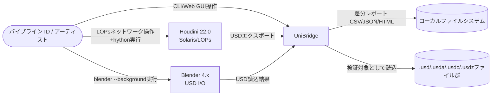
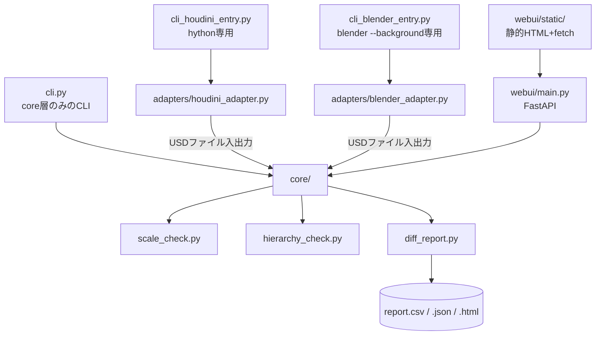
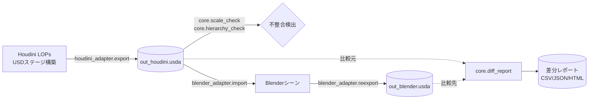

# 仕様書: DCC間フォーマット変換・検証ツール「UniBridge」

| 項目 | 値 |
|------|---|
| 版 | 0.1 |
| 作成日 | 2026-09-07 |
| 最終更新 | 2026-09-07 |
| ステータス | ドラフト |
| 著者 | 金子直樹 |
| 関連 | [要件定義書](./要件定義書.md) ／ 姉妹プロジェクト [Scene Doctor 仕様書](../../scene_doctor/docs/仕様書.md) ／ [PipeBoard mini 仕様書](../../pipeboard/docs/仕様書.md) |

> **セクション読み替えについて**: 本プロジェクトは2つのDCC（Houdini/Blender）とusd-coreを扱うツールであり、Webアプリではあるが簡易GUIに留まる。spec-proドメイン知識の §5 api-spec は「**core層のPython API + 簡易Web GUIのREST API**」の両方を扱うセクションとして読み替え、§6 screen-spec は「**簡易Web GUIの画面仕様**」として読み替える（Scene DoctorがHDAパラメータUIとして読み替えた前例、PipeBoard miniのapi-spec/screen-specの書式に倣う）。

---

## 1. quick-reference

| 項目 | 値 |
|------|---|
| リポジトリ | `~/3dcg-dev/unibridge`（公開後 `github.com/nokgc333/unibridge`） |
| core層のみのCLI実行 | `python cli.py diff --before a.usd --after b.usd` |
| Houdiniエクスポート実行 | `hython cli_houdini_entry.py export --lop /stage/out --output out.usda` |
| Blenderインポート検証実行 | `blender --background --python cli_blender_entry.py -- --usd out.usda` |
| 簡易Web GUI起動 | `uvicorn webui.main:app --reload`（`http://localhost:8000`） |
| テスト実行 | `pytest --cov=core -v`（usd-coreのみで完結、Houdini/Blender不要） |
| ベンチマーク実行 | `python tests/benchmark.py`（要件定義書§6.10、core層のみ） |
| Lint一括 | `black . && isort . && flake8 . && mypy core/ cli.py webui/` |
| CI | `.github/workflows/ci.yml`（push/PR時に自動実行、§11.2） |
| リリース | `git tag v0.1.0 && git push --tags` → GitHub Releases手動作成 |

---

## 2. overview-and-architecture

### 2.1 C4 Context



### 2.2 C4 Container



### 2.3 同期/非同期の境界

- CLI（`cli.py`）・core層の各検証関数はすべて同期処理。単一ファイルの検証はミリ秒〜秒オーダーで完結するため、非同期化の必要性が薄い。
- FR-008のバッチ処理（複数ファイル一括検証）のみ、`concurrent.futures.ProcessPoolExecutor`によるプロセス並列を用いる（§10で詳述）。
- 簡易Web GUI（FastAPI）はASGIとして非同期エンドポイントを提供するが、内部で呼び出すcore層の処理自体は同期関数であり、FastAPI側で`run_in_threadpool`相当の扱いにする（長時間処理によるイベントループのブロッキングを避けるため）。

### 2.4 データフロー



### 2.5 外部システム

なし（§10.5、要件定義書と同一）。

### 2.6 ADR索引

| ADR | タイトル | ステータス |
|---|---|---|
| ADR-0001 | データ交換フォーマットにOpenUSDを採用（FBXとの比較） | Accepted（本文§14.2） |
| ADR-0002 | Ports & Adaptersの発展形として2アダプタ構成を採用 | Accepted（本文§14.3） |
| ADR-0003 | Blender bpy経由での実シーン階層検証を行う設計 | Accepted（本文§14.4） |
| ADR-0004 | CLIと簡易Web GUIの両方を提供する設計 | Accepted（本文§14.5） |
| ADR-0005 | 自動修正ではなく検証+提示に留める設計 | Accepted（本文§14.6） |

### 2.7 障害時の縮退モード

| 障害 | 挙動 |
|---|---|
| バッチ処理中の1ファイル（ワーカープロセス）がクラッシュ | 当該ファイルのみ失敗として記録し、他のファイルの処理は継続する（SEC-004） |
| 命名規則YAMLが読み込めない | E004で早期終了し、他のチェック（座標系・スケール）はスキップしない設計とはしない（設定ミスを握りつぶさないため、Scene Doctorと同一方針） |
| 対象USDファイルが存在しない/破損している | E001で早期終了 |
| Houdini/Blenderが実行環境にインストールされていない | `houdini_adapter` / `blender_adapter`を経由する機能のみ利用不可（core層のみのCLI/Web GUI差分比較機能は引き続き利用可能） |

### 2.8 将来の拡張余地

- Unreal EngineのUSD対応（UE 5系はUSDプラグインを標準搭載）と連携し、ゲームパイプラインへの応用範囲を広げる（元企画書の発展アイデア）。UEはPythonバインディング（`unreal`モジュール）を持つため、`adapters/unreal_adapter.py`という3つ目のアダプタを追加する構成で対応可能な設計としてある（core/層のUSD非依存境界を維持していれば拡張は局所的）。
- Mayaへの対応（`adapters/maya_adapter.py`、MayaのUSD for Maya プラグイン経由）。
- コンポジションArc（Payload/Variant/Inherits/Specializes）の詳細検証（v1はSublayer/Referenceの基本階層検証に留める、要件定義書§2.3 Non-Goals 6）。
- Attributeレベルのハッシュ比較による差分検出の高精度化（要件定義書§11.2で言及）。
- ジョブキュー方式（Celery+Redis相当）への移行によるバッチ処理の分散化（要件定義書§11.2）。

---

## 3. tech-stack-and-repo

### 3.1 pyproject.toml（全文）

```toml
[project]
name = "unibridge"
version = "0.1.0"
description = "Houdini SolarisとBlenderのUSD I/OでOpenUSDシーンを相互変換・検証するツール"
readme = "README.md"
requires-python = ">=3.11"
license = { text = "MIT" }
dependencies = [
    "usd-core>=24.8,<25",
    "PyYAML>=6.0.2,<7",
    "fastapi>=0.115,<1",
    "uvicorn[standard]>=0.30,<1",
    "python-multipart>=0.0.9",
]

[project.optional-dependencies]
dev = [
    "pytest>=8.3,<9",
    "pytest-cov>=5.0,<6",
    "black>=24.0",
    "flake8>=7.1",
    "isort>=5.13",
    "mypy>=1.11",
    "pip-audit>=2.7",
    "types-PyYAML",
    "httpx>=0.27",
]

[build-system]
requires = ["setuptools>=68"]
build-backend = "setuptools.build_meta"

[tool.mypy]
strict = true
disallow_untyped_defs = true
warn_unused_ignores = true
# adapters/ は hou/bpy スタブが無いため型チェック対象から除外する
exclude = ["adapters/"]

[tool.black]
line-length = 100

[tool.isort]
profile = "black"

[tool.pytest.ini_options]
addopts = "--cov=core --cov-report=term-missing"
testpaths = ["tests"]
```

> 補足: `hou`はHoudini同梱のhython環境、`bpy`はBlender同梱のPython環境にしか存在しないため、`pip install -e ".[dev]"`だけではimportできない。CI（GitHub Actions）では`adapters/`を型チェック・実行対象から除外し、`core/` `cli.py` `webui/`（の純粋ロジック部分）のみをテストする設計にしている（要件定義書FR-006相当、Scene DoctorのFR-006と同一方針）。`usd-core`はDCCを必要としないpip配布パッケージであり、CI環境にもインストール可能。

### 3.2 ディレクトリ構成

```
unibridge/
├── core/
│   ├── __init__.py
│   ├── scale_check.py       # 座標系(upAxis)・スケール単位(metersPerUnit)の検出・変換・警告
│   ├── hierarchy_check.py   # Xform/Prim階層の命名規則チェック
│   ├── diff_report.py       # Prim数・Material数の差分比較、CSV/JSON/HTML出力
│   ├── rules.py             # 命名規則YAML読込・バリデーション
│   └── report_models.py     # DiffEntry / DiffReport 等のデータクラス定義
├── adapters/
│   ├── houdini_adapter.py   # hou.LopNode.stage() 経由のUSDエクスポート、hython専用
│   └── blender_adapter.py   # bpy.ops.wm.usd_import/export 経由の読込検証、blender --background専用
├── cli.py                   # core層のみで完結するCLIエントリポイント（diff/hierarchy/scale検証）
├── cli_houdini_entry.py     # hythonから起動するCLIエントリポイント（export）
├── cli_blender_entry.py     # blenderから起動するCLIエントリポイント（import検証）
├── webui/
│   ├── main.py               # FastAPIアプリケーション
│   ├── routers/
│   │   ├── validate.py       # USDアップロード→検証エンドポイント
│   │   └── report.py         # 差分レポート取得エンドポイント
│   └── static/
│       ├── index.html        # 単一ページ、アップロードフォーム+結果表示
│       └── app.js             # fetchベースの最小限のフロントロジック
├── rules/
│   └── default.yaml          # 既定命名規則
├── sample_scenes/
│   ├── mismatched_scale.usda   # 検証用: cm/m不整合を含むフィクスチャ
│   ├── mismatched_upaxis.usda  # 検証用: Y-up/Z-up不整合を含むフィクスチャ
│   └── consistent_scene.usda   # 検証用: 不整合なしのフィクスチャ
├── tests/
│   ├── fixtures/
│   │   └── large_scene/        # NFR-001計測用フィクスチャ生成スクリプト
│   ├── test_scale_check.py
│   ├── test_hierarchy_check.py
│   ├── test_diff_report.py
│   ├── test_cli.py
│   └── benchmark.py
├── docs/
│   ├── 要件定義書.md
│   ├── 仕様書.md
│   └── adr/
├── .github/workflows/ci.yml
├── pyproject.toml
├── LICENSE
└── README.md
```

### 3.3 環境数・環境差分管理

環境は`local`のみ（Houdini実行環境 + Blender実行環境 + usd-core専用venvの3実行経路。開発・実行を同一マシンで行う個人開発）。

### 3.4 パッケージマネージャ

`pip` + `pyproject.toml`（venv標準構成）。Scene Doctorと同一の管理方式を踏襲し、Poetry等の追加ツールは導入しない。

### 3.5 ランタイムバージョン固定

| 項目 | バージョン |
|---|---|
| Houdini | 22.0 Indie / Education |
| Blender | 4.x系（LTS推奨） |
| Python（hython同梱） | Houdini 22.0のビルドに準拠 |
| Python（Blender同梱） | Blender 4.xのビルドに準拠 |
| Python（core/CLI/Web GUI用venv） | 3.11 / 3.12（CI matrix） |

### 3.6 主要コマンド一覧

| コマンド | 用途 |
|---|---|
| `python cli.py diff --before a.usd --after b.usd --format all` | 差分レポート生成（core層のみ） |
| `python cli.py scale-check --source a.usd --target b.usd` | 座標系・スケール不整合チェック |
| `python cli.py hierarchy-check --usd a.usd --rules rules/default.yaml` | 命名規則チェック |
| `python cli.py batch --dir sample_scenes/ --format json` | ディレクトリ配下の一括検証（FR-008） |
| `hython cli_houdini_entry.py export --lop /stage/out --output out.usda` | Houdini LOPsからのエクスポート |
| `blender --background --python cli_blender_entry.py -- --usd out.usda --reexport` | Blenderでの読込検証+再エクスポート |
| `uvicorn webui.main:app --reload` | 簡易Web GUI起動 |

---

## 4. data-design

### 4.1 概要

本プロジェクトのデータは大別して (a) USDステージそのもの（`pxr.Usd.Stage`が保持する構造化データ、外部ファイルとして`.usda`/`.usdc`に永続化される）、(b) 命名規則設定（YAML）、(c) 検証結果（差分レポート、DiffEntry/DiffReportデータクラス）の3種類からなる。データベース（RDB/NoSQL）は使用しない。

### 4.2 USDステージ・Prim・階層構造のスキーマ定義

USD自体のスキーマはPixarの公式仕様に準拠するため独自定義しないが、UniBridgeが検証対象として着目するメタデータ・Prim属性を以下に整理する。

```python
# core/report_models.py（抜粋、Stageメタデータ抽出結果の型）
from __future__ import annotations

from dataclasses import dataclass


@dataclass(frozen=True)
class StageMetadataSnapshot:
    """USD StageからUniBridgeが検証に用いるメタデータのスナップショット。"""

    source_path: str
    up_axis: str              # "Y" | "Z"（pxr.UsdGeom.GetStageUpAxis()の戻り値）
    up_axis_is_explicit: bool  # Stageに明示設定されているか（暗黙依存の警告判定に使用）
    meters_per_unit: float     # pxr.UsdGeom.GetStageMetersPerUnit()の戻り値
    meters_per_unit_is_explicit: bool
    prim_count: int
    default_prim_path: str | None


@dataclass(frozen=True)
class PrimRecord:
    """階層走査（hierarchy_check）で収集する単一Primの情報。"""

    path: str               # 例: "/root/geo/char_hero"
    type_name: str           # 例: "Xform", "Mesh", "Material"
    parent_path: str | None
    has_authored_xform: bool
```

### 4.3 差分レポートのデータ辞書

```python
# core/report_models.py（続き）
from enum import Enum


class Severity(str, Enum):
    ERROR = "error"
    WARNING = "warning"
    INFO = "info"


class DiffCategory(str, Enum):
    UP_AXIS_MISMATCH = "up_axis_mismatch"
    SCALE_MISMATCH = "scale_mismatch"
    IMPLICIT_METADATA = "implicit_metadata"
    NAMING_VIOLATION = "naming_violation"
    PRIM_COUNT_DIFF = "prim_count_diff"
    MATERIAL_COUNT_DIFF = "material_count_diff"
    PRIM_REMOVED = "prim_removed"
    PRIM_ADDED = "prim_added"


@dataclass(frozen=True)
class DiffEntry:
    category: DiffCategory
    target_path: str          # Primパス、またはStage全体を指す "(stage)"
    message: str
    severity: Severity
    before_value: str | None = None
    after_value: str | None = None


@dataclass
class DiffReport:
    source_stage: str
    target_stage: str
    generated_at: str          # UTC ISO 8601
    prim_count_before: int
    prim_count_after: int
    material_count_before: int
    material_count_after: int
    entries: list[DiffEntry]

    @property
    def has_errors(self) -> bool:
        return any(e.severity == Severity.ERROR for e in self.entries)
```

| キー | 型 | 必須 | 説明 |
|---|---|---|---|
| `category` | DiffCategory (enum) | ◯ | 差分の種別。座標系不一致・スケール不一致・命名違反・プリム数差分等 |
| `target_path` | string | ◯ | 対象のPrimパス、またはStage全体を示す固定文字列 |
| `severity` | Severity (enum) | ◯ | `error` / `warning` / `info`。スケール10倍超の不整合はerror（要件定義書FR-003 AC-3） |
| `before_value` / `after_value` | string \| null | - | 差分の前後値（例: `upAxis: Y` → `upAxis: Z`） |

### 4.4 命名規則ファイルスキーマ

```yaml
# rules/default.yaml
schema_version: 1
project_type: generic
naming_rules:
  - pattern: '^/[a-zA-Z0-9_]+/xform_[a-z0-9_]+$'
    applies_to_prim_type: Xform
    description: "XformプリミティブはXform_で始まるsnake_case階層パス"
    rename_hint: "xform_{seq:03d}"
  - pattern: '^/[a-zA-Z0-9_]+/geo_[a-z0-9_]+$'
    applies_to_prim_type: Mesh
    description: "MeshプリミティブはGeo_で始まるsnake_case階層パス"
    rename_hint: "geo_{seq:03d}"
  - pattern: '.*'
    applies_to_prim_type: all
    description: "その他Prim種別は既定では規則を課さない（明示的に緩いルールとして定義）"
exclude_patterns:
  - '^/.*_WIP.*$'   # 作業用Primの命名規則除外パターン（要件定義書§3.3）
```

### 4.5 PII分類

該当なし（個人情報を扱わないローカルツールのため）。

### 4.6 保持期間

該当なし。レポートファイルはユーザー自身のファイルシステム上に生成され、UniBridgeが保持期間を管理することはない（Scene Doctorと同一方針）。

### 4.7 監査カラム

該当なし（DBを使用しないため）。`DiffReport.generated_at`が唯一の監査目的相当のタイムスタンプであり、UTC ISO 8601形式で記録する。

### 4.8 ID戦略

該当なし。USDファイルパス（および内部的にはPrimパス）が自然キーとして機能するため、独自のID採番は行わない。

### 4.9 インデックス戦略・マイグレーション戦略・バックアップ

該当なし（DBを使用しないローカルツールのため）。

---

## 5. api-spec（core層のPython API + 簡易Web GUIのREST API）

### 5.1 core層のPython API設計原則

`core/`配下の全関数は、USDファイルパス（`str` / `pathlib.Path`）または`pxr.Usd.Stage`オブジェクトを直接引数に取り、副作用のない純粋関数として設計する（読み取り専用が既定、SEC-003）。戻り値は必ず`core/report_models.py`のデータクラス（`DiffEntry`, `StageMetadataSnapshot`等）のリストまたはインスタンスとする。

### 5.2 core/scale_check.py（関数シグネチャ・実装、全文）

```python
# core/scale_check.py
from __future__ import annotations

from pxr import Usd, UsdGeom

from core.report_models import DiffCategory, DiffEntry, Severity, StageMetadataSnapshot

SCALE_MISMATCH_ERROR_RATIO = 10.0  # この倍率以上の不一致はseverity=errorに引き上げる（要件定義書FR-003 AC-3）


def extract_metadata(stage: Usd.Stage, source_path: str) -> StageMetadataSnapshot:
    """Stageから座標系・スケール単位のメタデータを抽出する。未設定時はUSD既定値を採用しつつ
    is_explicitフラグをFalseにし、暗黙依存であることを呼び出し側が判定できるようにする。
    """
    up_axis_authored = stage.HasAuthoredMetadata("upAxis")
    up_axis = UsdGeom.GetStageUpAxis(stage)  # 未設定時は既定 "Y"

    mpu_authored = stage.HasAuthoredMetadata("metersPerUnit")
    meters_per_unit = UsdGeom.GetStageMetersPerUnit(stage)  # 未設定時は既定 1.0

    return StageMetadataSnapshot(
        source_path=source_path,
        up_axis=up_axis,
        up_axis_is_explicit=up_axis_authored,
        meters_per_unit=meters_per_unit,
        meters_per_unit_is_explicit=mpu_authored,
        prim_count=sum(1 for _ in stage.Traverse()),
        default_prim_path=(
            stage.GetDefaultPrim().GetPath().pathString if stage.HasDefaultPrim() else None
        ),
    )


def check_up_axis_mismatch(
    source: StageMetadataSnapshot, target: StageMetadataSnapshot
) -> list[DiffEntry]:
    entries: list[DiffEntry] = []
    if not source.up_axis_is_explicit or not target.up_axis_is_explicit:
        entries.append(
            DiffEntry(
                category=DiffCategory.IMPLICIT_METADATA,
                target_path="(stage)",
                message="upAxis is not explicitly authored on one or both stages; "
                "relying on USD default (Y) can silently cause mismatches",
                severity=Severity.WARNING,
            )
        )
    if source.up_axis != target.up_axis:
        entries.append(
            DiffEntry(
                category=DiffCategory.UP_AXIS_MISMATCH,
                target_path="(stage)",
                message=f"upAxis mismatch: source={source.up_axis}, target={target.up_axis}",
                severity=Severity.ERROR,
                before_value=source.up_axis,
                after_value=target.up_axis,
            )
        )
    return entries


def check_scale_mismatch(
    source: StageMetadataSnapshot, target: StageMetadataSnapshot
) -> list[DiffEntry]:
    entries: list[DiffEntry] = []
    if source.meters_per_unit == 0 or target.meters_per_unit == 0:
        raise ValueError("metersPerUnit must be non-zero")

    ratio = max(source.meters_per_unit, target.meters_per_unit) / min(
        source.meters_per_unit, target.meters_per_unit
    )
    if ratio > 1.0:
        severity = Severity.ERROR if ratio >= SCALE_MISMATCH_ERROR_RATIO else Severity.WARNING
        entries.append(
            DiffEntry(
                category=DiffCategory.SCALE_MISMATCH,
                target_path="(stage)",
                message=(
                    f"metersPerUnit mismatch: source={source.meters_per_unit}, "
                    f"target={target.meters_per_unit} (ratio={ratio:.2f}x)"
                ),
                severity=severity,
                before_value=str(source.meters_per_unit),
                after_value=str(target.meters_per_unit),
            )
        )
    return entries
```

座標系変換行列・スケール変換の実装（`apply_conversion=true`時）は§8.1で詳述する。

### 5.3 core/hierarchy_check.py（関数シグネチャ）

```python
# core/hierarchy_check.py
from __future__ import annotations

import re
from dataclasses import dataclass

from pxr import Usd

from core.report_models import DiffCategory, DiffEntry, Severity


@dataclass(frozen=True)
class NamingRule:
    pattern: re.Pattern[str]
    applies_to_prim_type: str
    description: str
    rename_hint: str | None = None


def check_naming(
    stage: Usd.Stage, rules: list[NamingRule], exclude_patterns: list[re.Pattern[str]]
) -> list[DiffEntry]:
    """Stage内の全Primを走査し、命名規則に違反するPrimを検出する。
    exclude_patternsに一致するPrimパスは検証対象から除外する（要件定義書§3.3）。
    """
    ...


def _applicable_rule(prim_type: str, rules: list[NamingRule]) -> NamingRule | None:
    """Prim種別に対応する規則を1件返す（"all"にマッチする規則はフォールバックとして最後に評価）。"""
    ...
```

> 実装本体は要件定義書FR-004のACを満たすよう、`stage.Traverse()`で全PrimをTraverseし、`prim.GetTypeName()`と`exclude_patterns` → `rules`の順に照合する。コード全文は実装フェーズでリポジトリに反映し、本セクションを実ファイルへのリンクに置き換える（<!-- 要レビュー -->）。

### 5.4 core/diff_report.py（関数シグネチャ・実装、全文）

```python
# core/diff_report.py
from __future__ import annotations

from datetime import datetime, timezone

from pxr import Usd, UsdShade

from core.report_models import DiffCategory, DiffEntry, DiffReport, Severity


def _count_prims_by_type(stage: Usd.Stage) -> dict[str, int]:
    counts: dict[str, int] = {}
    for prim in stage.Traverse():
        counts[prim.GetTypeName()] = counts.get(prim.GetTypeName(), 0) + 1
    return counts


def _material_count(stage: Usd.Stage) -> int:
    return sum(1 for prim in stage.Traverse() if prim.IsA(UsdShade.Material))


def _prim_paths(stage: Usd.Stage) -> set[str]:
    return {prim.GetPath().pathString for prim in stage.Traverse()}


def build_diff_report(
    before_stage: Usd.Stage, after_stage: Usd.Stage, source_path: str, target_path: str
) -> DiffReport:
    before_paths = _prim_paths(before_stage)
    after_paths = _prim_paths(after_stage)

    entries: list[DiffEntry] = []

    for removed in sorted(before_paths - after_paths):
        entries.append(
            DiffEntry(
                category=DiffCategory.PRIM_REMOVED,
                target_path=removed,
                message=f"prim {removed} exists in before but missing in after",
                severity=Severity.ERROR,
            )
        )
    for added in sorted(after_paths - before_paths):
        entries.append(
            DiffEntry(
                category=DiffCategory.PRIM_ADDED,
                target_path=added,
                message=f"prim {added} newly appears in after (not present in before)",
                severity=Severity.INFO,
            )
        )

    before_material_count = _material_count(before_stage)
    after_material_count = _material_count(after_stage)
    if before_material_count != after_material_count:
        entries.append(
            DiffEntry(
                category=DiffCategory.MATERIAL_COUNT_DIFF,
                target_path="(stage)",
                message=(
                    f"material count changed: {before_material_count} -> {after_material_count}"
                ),
                severity=Severity.WARNING,
                before_value=str(before_material_count),
                after_value=str(after_material_count),
            )
        )

    return DiffReport(
        source_stage=source_path,
        target_stage=target_path,
        generated_at=datetime.now(timezone.utc).isoformat(),
        prim_count_before=len(before_paths),
        prim_count_after=len(after_paths),
        material_count_before=before_material_count,
        material_count_after=after_material_count,
        entries=entries,
    )
```

計算量: Stageの総Prim数を`N`とすると、`_prim_paths`・`_material_count`・`_count_prims_by_type`はいずれも`O(N)`のTraverseで完結する。集合演算（差集合）も`O(N)`のためアルゴリズム全体は`O(N)`（要件定義書NFR-001対策として明記）。

### 5.5 cli.py（CLIインターフェース仕様、core層のみ）

```
使い方:
  python cli.py diff --before <path> --after <path> [--format {csv,json,html,all}] [--out <dir>]
  python cli.py scale-check --source <path> --target <path> [--apply]
  python cli.py hierarchy-check --usd <path> [--rules <path>]
  python cli.py batch --dir <path> [--format {csv,json}] [--workers <int>]

終了コード:
  0: 検証OK（不整合0件）
  1: 不整合N件検出（N>=1）
  上記以外は §5.6 のエラーコードに対応
```

### 5.6 cli_houdini_entry.py / cli_blender_entry.py（アダプタ経由CLI）

```
使い方（Houdini側、hython専用）:
  hython cli_houdini_entry.py export --lop <lop_node_path> --output <path> [--format {usda,usdc}]

使い方（Blender側、blender --background専用。Blender自体の引数分離規約に従い "--" 以降を渡す）:
  blender --background --python cli_blender_entry.py -- --usd <path> [--reexport] [--out <path>]
```

### 5.7 エラーコード一覧

| code | exit code | 意味 |
|---|---|---|
| E001 | 10 | 対象USDファイルが存在しない、または読み込めない（破損・非対応フォーマット） |
| E002 | 11 | 不正なパラメータ値（出力パスの拡張子不正等） |
| E003 | 12 | 指定ノードが期待する種別（LOPノード等）でない |
| E004 | 13 | 命名規則YAMLの構文エラー・必須キー欠落 |
| E005 | 14 | 出力先ディレクトリへの書き込み権限がない |

> 0/1は「不整合の有無」を表すためCIゲートとして利用しやすいよう予約し、エラー系は10番台に割り当てて明確に区別する（Scene Doctorの規約を踏襲）。

### 5.8 core/rules.py（YAML読込・バリデーション実装）

```python
# core/rules.py（抜粋）
from __future__ import annotations

import re
from pathlib import Path
from typing import Any

import yaml

from core.hierarchy_check import NamingRule

REQUIRED_KEYS = {"schema_version", "project_type", "naming_rules"}


class RuleFileError(Exception):
    """命名規則YAMLの読込・検証エラー（E004に対応）。"""


def load_naming_rules(path: Path) -> tuple[list[NamingRule], list[re.Pattern[str]]]:
    try:
        raw: dict[str, Any] = yaml.safe_load(path.read_text(encoding="utf-8"))  # SEC-001
    except yaml.YAMLError as exc:
        raise RuleFileError(f"{path} contains invalid YAML: {exc}") from exc

    if not isinstance(raw, dict):
        raise RuleFileError(f"{path} must be a YAML mapping at the top level")

    missing = REQUIRED_KEYS - raw.keys()
    if missing:
        raise RuleFileError(f"{path} is missing required key(s): {', '.join(sorted(missing))}")

    rules = [
        NamingRule(
            pattern=re.compile(entry["pattern"]),
            applies_to_prim_type=entry["applies_to_prim_type"],
            description=entry["description"],
            rename_hint=entry.get("rename_hint"),
        )
        for entry in raw["naming_rules"]
    ]
    exclude_patterns = [re.compile(p) for p in raw.get("exclude_patterns", [])]
    return rules, exclude_patterns
```

### 5.9 簡易Web GUI用REST API

**API設計原則・ベースURL**: REST、ベースURLは`http://localhost:8000`。バージョンプレフィックスは付けない（PipeBoard miniの判断を踏襲、v1のみのローカル実行ツールのため）。全レスポンスは`application/json; charset=utf-8`。

**エンドポイント一覧**

| Method | Path | 概要 | 認証 |
|---|---|---|---|
| POST | `/api/validate` | USDファイルをアップロードし、座標系/スケール/命名を検証（multipart） | 不要 |
| POST | `/api/diff` | 2つのUSDファイルをアップロードし、差分レポートを生成（multipart） | 不要 |
| GET | `/api/reports/{report_id}` | 過去に生成したレポートを取得 | 不要 |
| GET | `/api/rules` | 現在の命名規則YAMLの内容を取得（表示用） | 不要 |
| GET | `/healthz` | ヘルスチェック | 不要 |

**実装スケルトン（FastAPI）**

```python
# webui/main.py
from __future__ import annotations

from fastapi import FastAPI
from fastapi.middleware.cors import CORSMiddleware
from fastapi.staticfiles import StaticFiles

from webui.routers import report, validate

app = FastAPI(title="UniBridge Web GUI", version="0.1.0")

# ローカル実行前提のため開発時は緩め。外部公開時はallow_originsを限定する（SEC-006関連）
app.add_middleware(
    CORSMiddleware,
    allow_origins=["http://localhost:8000"],
    allow_methods=["*"],
    allow_headers=["*"],
)

app.include_router(validate.router, prefix="/api", tags=["validate"])
app.include_router(report.router, prefix="/api", tags=["report"])
app.mount("/", StaticFiles(directory="webui/static", html=True), name="static")


@app.get("/healthz")
def healthz() -> dict[str, str]:
    return {"status": "ok"}
```

```python
# webui/routers/validate.py（抜粋、FR-007対応）
from __future__ import annotations

import tempfile
import uuid
from pathlib import Path

from fastapi import APIRouter, HTTPException, UploadFile, status
from pxr import Usd

from core.diff_report import build_diff_report
from core.scale_check import check_scale_mismatch, check_up_axis_mismatch, extract_metadata

router = APIRouter()

ALLOWED_EXTENSIONS = {".usd", ".usda", ".usdc", ".usdz"}
MAX_FILE_SIZE = 200 * 1024 * 1024  # 200MB（SEC-006、要件定義書NFR-006のusdz読込を考慮）


@router.post("/validate")
async def validate_usd(file: UploadFile) -> dict[str, object]:
    ext = Path(file.filename or "").suffix.lower()
    if ext not in ALLOWED_EXTENSIONS:
        # SEC-006: 拡張子の検証（なりすまし拡張子対策）
        raise HTTPException(status_code=400, detail="Unsupported file type")

    contents = await file.read()
    if len(contents) > MAX_FILE_SIZE:
        raise HTTPException(status_code=413, detail="File too large (max 200MB)")

    # SEC-006: UUIDベースのファイル名で保存（パストラバーサル・衝突防止、PipeBoard miniのSEC-002と同一思想）
    with tempfile.TemporaryDirectory() as tmp_dir:
        saved_path = Path(tmp_dir) / f"{uuid.uuid4()}{ext}"
        saved_path.write_bytes(contents)

        stage = Usd.Stage.Open(str(saved_path))
        if stage is None:
            raise HTTPException(status_code=422, detail="Failed to open USD stage (E001)")

        metadata = extract_metadata(stage, source_path=file.filename or "uploaded.usd")

    return {
        "up_axis": metadata.up_axis,
        "up_axis_is_explicit": metadata.up_axis_is_explicit,
        "meters_per_unit": metadata.meters_per_unit,
        "meters_per_unit_is_explicit": metadata.meters_per_unit_is_explicit,
        "prim_count": metadata.prim_count,
    }
```

**error-catalog（RFC 9457準拠）**: PipeBoard miniと同一の`application/problem+json`形式を採用する。

| code | type URI | status | title 例 | 発生条件 |
|---|---|---|---|---|
| ERR-NOTFOUND | /probs/404 | 404 | `Report {id} not found` | 存在しないレポートID指定 |
| ERR-VALIDATION | /probs/422 | 422 | `Failed to open USD stage` | 破損USDファイル |
| ERR-UNSUPPORTED-MEDIA | /probs/400 | 400 | `Unsupported file type` | 拡張子不一致 |
| ERR-PAYLOAD-TOO-LARGE | /probs/413 | 413 | `File too large (max 200MB)` | サイズ超過アップロード |
| ERR-INTERNAL | /probs/500 | 500 | `Internal Server Error`（詳細はログのみ） | 予期しない例外 |

**ページネーション・レートリミット・Webhook**: v1のデータ量・利用規模を鑑みいずれも実装しない（PipeBoard miniと同一判断）。

**OpenAPI**: FastAPIの自動生成（`/openapi.json`, `/docs`）をそのまま正本とする。

**CORS設定**: ローカル実行前提のため`allow_origins=["http://localhost:8000"]`に限定する（PipeBoard miniより厳格。理由: 決済等のデモ公開シナリオがなく、ローカル利用に閉じるため）。

---

## 6. screen-spec（簡易Web GUIの画面仕様）

### 6.1 画面一覧

| SCR-ID | 画面名 | URL | 認証 |
|---|---|---|---|
| SCR-001 | USD検証・差分レポート画面（単一ページ） | `/` | 不要 |

### 6.2 SCR-001 USD検証・差分レポート画面

- **URL**: `/`
- **認証**: 不要
- **目的**: USDファイル（単一または2ファイル）をアップロードし、座標系/スケール/命名の不整合警告、または差分レポートを表示する
- **API呼び出し**: `POST /api/validate`（単一ファイル検証）、`POST /api/diff`（2ファイル差分比較）、`GET /api/rules`（現在の命名規則表示）
- **レイアウト**:
  - 上部: タブ切り替え「単一ファイル検証」「差分比較」
  - 単一ファイル検証タブ: ファイルドロップゾーン1つ + 検証結果カード（upAxis/metersPerUnit/prim_count + 警告リスト）
  - 差分比較タブ: ファイルドロップゾーン2つ（Before/After）+ 差分レポート表（category/severity/target_path/message）
- **状態**:
  - idle: ドロップゾーンのみ表示
  - loading: アップロード中はスピナー表示
  - empty: 該当なし（結果が0件の場合は「不整合は検出されませんでした」の成功メッセージを表示）
  - error: アップロード失敗時（拡張子/サイズエラー、破損ファイル）はドロップゾーン直下にエラーメッセージ
  - success: 検証結果/差分レポート表示
- **操作**:
  - ドラッグ&ドロップまたはクリックでのファイル選択（`<input type="file">`のネイティブ機構を用いる、独自DnD実装は最小限）
  - 差分レポートの「CSVダウンロード」「JSONダウンロード」ボタン
- **バリデーション（フロント側、バックの二重チェック）**:
  | フィールド | バリデーション | エラー文言 |
  |---|---|---|
  | アップロードファイル | 拡張子 .usd/.usda/.usdc/.usdz、200MB以下 | "対応していないファイル形式です" / "ファイルサイズは200MBまでです" |
- **アクセシビリティ**: ドロップゾーンに`aria-label`、エラーメッセージはテキストで表示（色のみに依存しない、要件定義書§7）

### 6.3 共通コンポーネント

PipeBoard miniで使用したTailwind CSSベースのボタン・カード・トーストパターンを流用する。独自デザインシステムのゼロ構築は行わない（要件定義書§7）。

---

## 7. feature-spec

### 7.1 FR ↔ モジュール ↔ 画面/CLI ↔ レポート対応表

| FR-ID | 対応モジュール | 対応CLI/画面 | 対応レポート項目 |
|---|---|---|---|
| FR-001 | `adapters/houdini_adapter.py` | `cli_houdini_entry.py export` | StageMetadataSnapshot |
| FR-002 | `adapters/blender_adapter.py` | `cli_blender_entry.py` | StageMetadataSnapshot |
| FR-003 | `core/scale_check.py` | `cli.py scale-check`, SCR-001単一検証タブ | DiffCategory.UP_AXIS_MISMATCH / SCALE_MISMATCH / IMPLICIT_METADATA |
| FR-004 | `core/hierarchy_check.py`, `core/rules.py` | `cli.py hierarchy-check` | DiffCategory.NAMING_VIOLATION |
| FR-005 | `core/diff_report.py` | `cli.py diff`, SCR-001差分比較タブ | DiffReport全体（PRIM_REMOVED/ADDED, MATERIAL_COUNT_DIFF等） |
| FR-006 | `cli.py`, `cli_houdini_entry.py`, `cli_blender_entry.py` | - | - |
| FR-007 | `webui/` | SCR-001 | - |
| FR-008 | `cli.py batch` | `cli.py batch --dir` | 集約report.csv/json |

### 7.2 シナリオ（FR-003 座標系・スケール不整合の例）

- **Happy**: ユーザーがHoudini側のUSD（`metersPerUnit=1.0`, `upAxis=Y`）とBlender側のUSD（`metersPerUnit=1.0`, `upAxis=Y`）をSCR-001の差分比較タブでアップロード → 不整合0件、成功メッセージ表示。
- **Alternative**: 一方が`metersPerUnit=0.01`（cm単位）の場合 → ratio=100倍としてseverity=errorの警告が表示される。
- **Error**: 破損したUSDファイルをアップロード → E001相当、`POST /api/validate`が422を返し、フロントにエラーメッセージ表示。

### 7.3 副作用

- `core/scale_check.py`・`core/hierarchy_check.py`・`core/diff_report.py`はいずれも読み取り専用（副作用なし、SEC-003）。
- `apply_conversion=true`を明示指定した場合のみ、`core/scale_check.py`の変換関数（§8.1）が新規USDファイルを生成する。既存ファイルを上書きすることはない。

### 7.4 冪等性

`cli.py diff` / `scale-check` / `hierarchy-check`はいずれも同一入力に対し同一結果を返す純粋な読み取り処理である。`cli.py batch`によるバッチ実行も同様に、同一ディレクトリへの再実行は同一の集約レポートを生成する（決定的）。

---

## 8. business-logic

### 8.1 座標系変換の計算式（Y-up⇔Z-up行列変換）

USDの`upAxis`は`Y`または`Z`のいずれかを取る。Y-upからZ-upへの変換（およびその逆）は、Y軸とZ軸を入れ替える回転として表現できる。具体的には、X軸周りに-90度（Y-up→Z-up）または+90度（Z-up→Y-up）回転させる変換行列を、Stageのルートに適用するXformOpとして挿入する。

```python
# core/scale_check.py（apply_conversionの実装イメージ、§8で詳述）
from pxr import Gf, Usd, UsdGeom

def _up_axis_rotation_matrix(source_axis: str, target_axis: str) -> Gf.Matrix4d:
    """Y-up <-> Z-up の変換行列を返す。それ以外の組み合わせは恒等行列。"""
    if source_axis == target_axis:
        return Gf.Matrix4d(1.0)  # 恒等行列
    if source_axis == "Y" and target_axis == "Z":
        # X軸周りに+90度回転（Y-upのY軸をZ-upのZ軸位置へ）
        return Gf.Matrix4d().SetRotate(Gf.Rotation(Gf.Vec3d(1, 0, 0), 90.0))
    if source_axis == "Z" and target_axis == "Y":
        # X軸周りに-90度回転（逆変換）
        return Gf.Matrix4d().SetRotate(Gf.Rotation(Gf.Vec3d(1, 0, 0), -90.0))
    raise ValueError(f"unsupported axis combination: {source_axis} -> {target_axis}")


def apply_up_axis_conversion(stage: Usd.Stage, target_axis: str, output_path: str) -> None:
    """Stageのデフォルトプリムのルートに変換用XformOpを挿入し、新規ファイルへ書き出す
    （既存ファイルへの上書きは行わない、SEC-003）。
    """
    current_axis = UsdGeom.GetStageUpAxis(stage)
    matrix = _up_axis_rotation_matrix(current_axis, target_axis)

    default_prim = stage.GetDefaultPrim()
    xformable = UsdGeom.Xformable(default_prim)
    xformable.AddTransformOp().Set(matrix)
    UsdGeom.SetStageUpAxis(stage, target_axis)

    stage.GetRootLayer().Export(output_path)
```

### 8.2 スケール単位変換の計算式（cm⇔m単位変換）

`metersPerUnit`は「1シーン単位が何メートルに相当するか」を表す。ソースの`metersPerUnit`をターゲットに合わせるには、両者の比率をスケール行列としてルートXformに乗算する。

```
scale_factor = source.metersPerUnit / target.metersPerUnit

例: source(m単位, metersPerUnit=1.0) -> target(cm単位, metersPerUnit=0.01)
    scale_factor = 1.0 / 0.01 = 100.0
    （sourceの1単位=1mが、targetでは1単位=1cmなので、ジオメトリのスケール値を100倍する必要がある）
```

```python
def apply_scale_conversion(stage: Usd.Stage, target_meters_per_unit: float, output_path: str) -> None:
    current_mpu = UsdGeom.GetStageMetersPerUnit(stage)
    scale_factor = current_mpu / target_meters_per_unit

    default_prim = stage.GetDefaultPrim()
    xformable = UsdGeom.Xformable(default_prim)
    xformable.AddScaleOp().Set(Gf.Vec3f(scale_factor, scale_factor, scale_factor))
    UsdGeom.SetStageMetersPerUnit(stage, target_meters_per_unit)

    stage.GetRootLayer().Export(output_path)
```

### 8.3 差分検出アルゴリズム（実装は§5.4に全文掲載）

計算量: Stageの総Prim数を`N`とすると、Prim集合の構築・Material数カウント・差集合演算のいずれも`O(N)`のため全体`O(N)`。Prim数2,000規模でもNFR-001の目標（15秒以内）を満たせる設計とする。

### 8.4 命名規則違反の判定アルゴリズム

```
for each prim in stage.Traverse():
    if prim.path matches any exclude_pattern:
        skip
    rule = 最初にapplies_to_prim_type == prim.type_name（または"all"）に一致する規則
    if rule.pattern が prim.path にマッチしない:
        violation として記録（rule.rename_hint があればヒントとして付与）
```

税・割引・ポイント等の計算式は本プロジェクトには存在しない（CG制作パイプラインツールという性質上、該当なし）。

---

## 9. security-implementation

### 9.1 auth

該当なし（認証を持たない、要件定義書§10.4）。

### 9.2 crypto

該当なし（暗号化・鍵管理を行わない）。

### 9.3 headers-and-csp

簡易Web GUIはローカル実行前提のため、本格的なCSPヘッダ設計は行わない。将来外部公開する場合は`Content-Security-Policy: default-src 'self'`程度の基本ヘッダを追加する拡張候補として記録する。

### 9.4 logging-and-pii

個人情報を扱わないため、PIIマスキングは不要。ログにはUSDファイルパス・検証結果のサマリのみを出力し、ファイル内容自体はログに含めない。

### 9.5 payment-pci

該当なし（決済機能を持たない）。

### 9.6 privacy-gdpr-appi

該当なし（個人情報・利用者アカウントを扱わないローカルツールのため）。

### 9.7 実装対応（要件定義書§12との対応）

| SEC-ID | 実装箇所 | テスト |
|---|---|---|
| SEC-001 | `core/rules.py: load_naming_rules()` の `yaml.safe_load` | TC-016 |
| SEC-002 | `adapters/houdini_adapter.py` / `adapters/blender_adapter.py`のサブプロセス起動は固定引数のみを組み立て、動的な文字列を`exec`/`eval`しない（静的レビューで担保） | CI上のgrepチェック（§11.2） |
| SEC-003 | `apply_conversion`系の関数のみが新規ファイルを生成し、それ以外は読み取り専用 | TC-006, TC-007（既定offの確認） |
| SEC-004 | `cli.py batch`のワーカープロセスをプロセス分離することで、1ファイルのクラッシュが他のワークアイテムに波及しないようにする | TC-019 |
| SEC-005 | `.github/workflows/ci.yml`の`pip-audit`ステップ | CI自体のgreen判定 |
| SEC-006 | `webui/routers/validate.py`の拡張子・サイズ検証 | TC-020 |

### 9.8 信頼境界の実装対応

要件定義書§12.2で定義した信頼境界の考え方を踏まえ、README（Design Decisions節）に以下を明記する。

```markdown
## セキュリティに関する注意
UniBridgeは検証対象の.usd/.hip/.blendファイルを「出所が既知の信頼済み入力」として扱います。
HoudiniやBlenderがPythonスクリプトを含む.hip/.blendファイルを開いた時点でコードを実行しうるため、
出所不明のファイルは開かないでください。UniBridge自身は
- yaml.safe_load以外でのYAML読込
- exec/evalによる動的コード実行
- 明示的な変換指定（apply_conversion）以外でのファイルの書き換え
を一切行いません。
```

---

## 10. async-and-batch

### 10.1 複数ファイル一括変換検証のバッチ処理設計（FR-008）

```
cli.py batch --dir sample_scenes/ --workers 4 の処理フロー:

1. 指定ディレクトリ配下の *.usd / *.usda / *.usdc を列挙する
2. concurrent.futures.ProcessPoolExecutor(max_workers=workers) で各ファイルを並列処理する
   - 各ワーカーは core/scale_check.py・core/hierarchy_check.py 相当の単一ファイル検証を実行
   - 1ファイルの処理で例外が発生しても、Futureのexception()経由で捕捉し、
     他のワーカーの処理は継続する（SEC-004）
3. 全ワーカー完了後、個別結果を集約してCSV/JSON統合レポートを生成する
4. 同一ディレクトリへの再実行は、既存レポートを冪等的に上書きする
```

### 10.2 ジョブ一覧（JOB-XXX形式）

| ID | 名称 | 種別 | トリガ | 依存 | リトライ | 失敗時対応 |
|---|---|---|---|---|---|---|
| JOB-001 | 単一ファイル検証 | 手動（CLI/Web GUI） | ユーザー操作 | - | なし（対話的） | エラーメッセージ表示 |
| JOB-002 | バッチ検証 | 手動（CLI） | ユーザー操作 | JOB-001と同一ロジックを並列実行 | 既定off（失敗ファイルのみ手動で再実行） | 集約レポートに失敗ファイルを明記 |

### 10.3 冪等性・タイムゾーン

イベントIDに相当する概念はなく、USDファイルパスをキーとして冪等性を担保する（同一パスへの再実行は上書き）。タイムスタンプ（`generated_at`）はUTC ISO 8601形式で記録し、表示のみユーザーのローカルタイムに変換する（Scene Doctorと同一方針）。

### 10.4 規模拡張時の設計（要件定義書§11.2の実装対応）

数千アセット規模になった場合の拡張ポイントを、現状の設計内にあらかじめ用意しておく。

- `ProcessPoolExecutor`の`max_workers`は既にCLI引数として外部化済みであり、将来ジョブキュー方式（Celery+Redis相当）に置き換える際も、ワーカー呼び出しのインターフェース（1ファイル→1検証結果の純粋関数）はそのまま流用できる設計とした。
- `cli.py`の終了コード規約（0=OK, 1=不整合あり, 10番台=エラー）は、GitHub Actions等のCI/CDパイプラインにそのまま組み込める設計になっており、「アセットがコミットされるたびに自動検証する」拡張が既存コードの変更なしに可能。

---

## 11. infra-and-runbook

### 11.1 環境構成・IaC

該当なし（ローカル実行のみ、クラウドインフラを持たない）。

### 11.2 CI/CD（全文）

```yaml
# .github/workflows/ci.yml
name: CI

on:
  push:
    branches: [main]
  pull_request:

jobs:
  test:
    runs-on: ubuntu-latest
    strategy:
      matrix:
        python-version: ["3.11", "3.12"]
    steps:
      - uses: actions/checkout@v4
      - uses: actions/setup-python@v5
        with:
          python-version: ${{ matrix.python-version }}
      - run: pip install -e ".[dev]"
      - run: black --check .
      - run: isort --check .
      - run: flake8 .
      - run: mypy core/ cli.py webui/ --exclude adapters/
      - name: "静的チェック: core/配下がhou/bpyをimportしていないこと（境界検証）"
        run: |
          if grep -rn "^import hou\|^from hou\|^import bpy\|^from bpy" core/; then
            echo "core/ must not depend on hou or bpy"; exit 1
          fi
      - name: "静的チェック: exec/evalの不使用（SEC-002）"
        run: |
          if grep -rn "exec(\|eval(" core/ adapters/ cli.py webui/; then
            echo "exec/eval must not be used"; exit 1
          fi
      - run: pytest --cov=core --cov-report=term-missing --cov-fail-under=80
      - run: pip-audit
```

> 補足: Houdini/BlenderはいずれもCIランナーにインストールされていないため、`adapters/houdini_adapter.py` / `adapters/blender_adapter.py`の動作確認はこのCIには含まれない。これらは§12の手動E2Eで担保する（Scene Doctorの判断と同一）。

### 11.3 Runbook

```markdown
## RB-001 CI red（pytest失敗）時の対応
1. `pytest -v`をローカルで実行し、失敗テストを特定
2. `core/`のロジック変更が原因の場合、対応するTC-IDを要件定義書§13.2で確認し、期待値とのズレを確認
3. `tests/fixtures/`のUSDフィクスチャ側の不備の可能性も確認

## RB-002 Houdini/Blenderでアダプタが期待通り動かない場合
1. hython/Blenderのコンソール出力でエラーログを確認
2. `adapters/houdini_adapter.py` / `adapters/blender_adapter.py`が期待するUSD出力形式を満たしているか手動確認
3. pytestは全てグリーンだが実機で失敗する場合、アダプタ層固有のバグ（DCC APIの挙動差異）である可能性が高いと判断する

## RB-003 座標系変換の結果が意図と異なる場合
1. §8.1の変換行列の符号（+90度/-90度）を再確認
2. Houdini/Blender双方でのXformOpの適用順序（Scale→Rotate→Translateの順序依存）を確認
```

### 11.4 SLO

該当なし（個人利用ツールのためSLA/SLOの概念を持たない）。

### 11.5 env-vars

| 変数名 | 必須 | 既定値 | 説明 |
|---|---|---|---|
| `UNIBRIDGE_RULES_DIR` | - | `./rules` | 命名規則YAMLの探索ディレクトリを上書きする |
| `UNIBRIDGE_MAX_UPLOAD_MB` | - | `200` | 簡易Web GUIのアップロード上限（MB） |
| `NO_COLOR` | - | 未設定 | CLI出力の色付けを無効化する（一般的な慣習に準拠） |

---

## 12. testing

### 12.1〜12.3

要件定義書§13の内容を正本とする。カバレッジ目標はCI上で`--cov-fail-under=80`として強制する（§11.2で実装済み）。

### 12.4 テストファイル対応表

| テストファイル | 対応TC-ID |
|---|---|
| `tests/test_scale_check.py` | TC-001〜007 |
| `tests/test_hierarchy_check.py` | TC-008〜010 |
| `tests/test_diff_report.py` | TC-011〜013 |
| `tests/test_cli.py` | TC-016, TC-017, TC-019 |
| （Web GUIのHTTPテスト、`httpx`経由） | TC-020 |
| （hou/bpy非依存の静的チェック、CI組み込み） | TC-017 |
| （手動E2E、実機） | TC-014, TC-015, TC-018 |
| `tests/benchmark.py` | 要件定義書§6.10の性能測定（CI組み込みはしない） |

### 12.5 tests/fixtures（設計方針）

```python
# tests/conftest.py（抜粋、フィクスチャUSDの生成方針）
import pytest
from pxr import Usd, UsdGeom


@pytest.fixture
def stage_y_up_meters(tmp_path):
    """upAxis=Y, metersPerUnit=1.0 の最小構成Stageを生成する。"""
    path = tmp_path / "y_up_m.usda"
    stage = Usd.Stage.CreateNew(str(path))
    UsdGeom.SetStageUpAxis(stage, UsdGeom.Tokens.y)
    UsdGeom.SetStageMetersPerUnit(stage, 1.0)
    prim = stage.DefinePrim("/root", "Xform")
    stage.SetDefaultPrim(prim)
    stage.GetRootLayer().Save()
    return path


@pytest.fixture
def stage_z_up_centimeters(tmp_path):
    """upAxis=Z, metersPerUnit=0.01 の最小構成Stageを生成する（不整合検証用）。"""
    path = tmp_path / "z_up_cm.usda"
    stage = Usd.Stage.CreateNew(str(path))
    UsdGeom.SetStageUpAxis(stage, UsdGeom.Tokens.z)
    UsdGeom.SetStageMetersPerUnit(stage, 0.01)
    prim = stage.DefinePrim("/root", "Xform")
    stage.SetDefaultPrim(prim)
    stage.GetRootLayer().Save()
    return path
```

usd-coreを用いてテストフィクスチャ自体をコードで生成することで、Houdini/Blenderいずれもインストール不要でCIが完結する（要件定義書NFR-004と対応）。

### 12.6 負荷テスト

`tests/benchmark.py`にてPrim数2,000規模のフィクスチャを`usd-core`で生成し、NFR-001（15秒以内）を実測する。Houdini/Blender実機を必要とする性能測定（エクスポート/インポート自体の速度）は本プロジェクトのスコープ外とし、CLIレベルの検証処理のみを対象とする。

---

## 13. conventions

- **命名規則**: 変数・関数はsnake_case、クラスはPascalCase、定数はUPPER_SNAKE_CASE
- **フォーマッタ/リンタ**: black（line-length=100）/ flake8 / isort（blackプロファイル）
- **型チェック**: mypy strict（`adapters/`は`hou`/`bpy`スタブ不在のため除外）
- **docstring**: Googleスタイル
- **インポート順序**: 標準ライブラリ → サードパーティ（`pxr`, `fastapi`等）→ 自プロジェクト内モジュール（`core.` `adapters.`等）の順
- **エラー処理**: 例外は握りつぶさず、CLI層/API層で捕捉してエラーコード（§5.7）またはHTTPステータスに変換する。空の`except:`は禁止

---

## 14. adr

### 14.1 ADR一覧

| ADR | タイトル | ステータス |
|---|---|---|
| ADR-0001 | データ交換フォーマットにOpenUSDを採用（FBXとの比較） | Accepted |
| ADR-0002 | Ports & Adaptersの発展形として2アダプタ構成を採用 | Accepted |
| ADR-0003 | Blender bpy経由での実シーン階層検証を行う設計 | Accepted |
| ADR-0004 | CLIと簡易Web GUIの両方を提供する設計 | Accepted |
| ADR-0005 | 自動修正ではなく検証+提示に留める設計 | Accepted |

> 本セクションは各ADRの要約を掲載する。全文は`docs/adr/000N-*.md`の独立ファイルを正本とする。

### 14.2 ADR-0001（要約、全文は`docs/adr/0001-adopt-usd-over-fbx.md`）

**Decision**: データ交換フォーマットにOpenUSDを採用し、FBXは不採用とする。理由はFBXが単一ファイルへのフラットな格納を前提とするのに対し、USDはレイヤー・コンポジションによる非破壊な重ね合わせを核とした設計であり、複数人が同じアセットの別側面（モデル/マテリアル/リギング）を非破壊で協業できる、業界標準の相互運用フォーマットだから。

### 14.3 ADR-0002（要約、全文は`docs/adr/0002-dual-adapter-architecture.md`）

**Decision**: Scene DoctorのPorts & Adaptersパターン（1アダプタ構成）を発展させ、Houdini用・Blender用の2つの独立したアダプタ（`houdini_adapter.py` / `blender_adapter.py`）を持つ構成を採用する。`core/`層はUSD（`pxr`）にのみ依存し、`hou`/`bpy`を一切importしない境界を維持する。

### 14.4 ADR-0003（要約、全文は`docs/adr/0003-bpy-for-scene-hierarchy-validation.md`）

**Decision**: USD自体はusd-core単体でも読めるが、Blenderの実際のシーン階層としての検証（Blenderが実際にどうインポートし、シーングラフに反映したか）にはbpy経由の実データが必要と判断し、`blender_adapter.py`でbpyを使用する。

### 14.5 ADR-0004（要約、全文は`docs/adr/0004-cli-and-web-gui.md`）

**Decision**: CLIを主要インターフェースとしつつ、非開発者向けにFastAPI+静的HTMLの簡易Web GUIも提供する。PipeBoard miniのようなフル機能のNext.jsアプリは、UniBridgeが扱う情報表示の単純さに対して過剰と判断し不採用とした。

### 14.6 ADR-0005（要約、全文は`docs/adr/0005-report-only-no-autofix.md`）

**Decision**: 座標系・スケール単位の不整合を検出しても、既定では変換を実行しない。`apply_conversion=true`という明示的なユーザー操作を必須とする（Scene DoctorのADR-0003, PipeInitの`--apply`既定offと同一の設計思想）。

---

## 15. postmortems

該当なし（実装前のため実績なし）。運用方針: `docs/postmortems/YYYY-MM-DD-incident.md`にSummary/Timeline/Impact/Root Cause/Action Items/Lessons Learnedを記載し、Blameless原則（人を責めずプロセスを改善する）で運用する（Scene Doctorと同一方針）。実装後、Houdini/Blender実機検証で発覚した問題があれば本セクションに実績を追記する。

---

## 16. annex

### 16.A トレーサビリティマトリクス

要件定義書§13.4を正本とする。実装対応列（本書追加分）：

| BR-ID | FR-ID | 実装ファイル | 主要関数 | TC-ID |
|---|---|---|---|---|
| BR-001 | FR-001 | `adapters/houdini_adapter.py` | `export_stage_from_lop()` | TC-014 |
| BR-001 | FR-002 | `adapters/blender_adapter.py` | `import_and_validate()` | TC-015 |
| BR-002 | FR-003 | `core/scale_check.py` | `check_up_axis_mismatch()`, `check_scale_mismatch()`, `apply_up_axis_conversion()`, `apply_scale_conversion()` | TC-001〜007 |
| BR-003 | FR-004 | `core/hierarchy_check.py`, `core/rules.py` | `check_naming()`, `load_naming_rules()` | TC-008〜010, TC-016 |
| BR-004 | FR-005 | `core/diff_report.py` | `build_diff_report()` | TC-011〜013 |
| BR-005 | FR-006, FR-007, FR-008 | `cli.py`, `webui/`, | - | TC-019, TC-020 |
| BR-006 | FR-001〜005 | `sample_scenes/` | - | TC-017, TC-018 |

### 16.B 暗号パラメータ表

該当なし（暗号化・鍵管理を行わない）。

### 16.C USD用語集（詳細版）

要件定義書§1.5を正本とする。実装時に頻出するAPIとの対応関係を以下に補足する。

| 用語 | 対応する主要API（usd-core / `pxr`） |
|---|---|
| Stage | `pxr.Usd.Stage`（`Usd.Stage.Open()` / `CreateNew()`） |
| Layer | `pxr.Sdf.Layer`（`stage.GetRootLayer()`） |
| Prim | `pxr.Usd.Prim`（`stage.GetPrimAtPath()` / `stage.Traverse()`） |
| upAxis | `pxr.UsdGeom.GetStageUpAxis()` / `SetStageUpAxis()` |
| metersPerUnit | `pxr.UsdGeom.GetStageMetersPerUnit()` / `SetStageMetersPerUnit()` |
| Xform / XformOp | `pxr.UsdGeom.Xformable`（`AddTransformOp()` / `AddScaleOp()` 等） |
| Material | `pxr.UsdShade.Material`（`prim.IsA(UsdShade.Material)`での判定） |
| Sublayer | `pxr.Sdf.Layer.subLayerPaths` |
| Reference | `pxr.Usd.Prim.GetReferences()` |

### 16.D スクリプトインベントリ（PCI DSS Req 6.4.3相当）

該当なし（決済画面・第三者JSの読み込みを持たないため対象外）。ただし簡易Web GUIが読み込む静的アセット（`webui/static/app.js`）は自プロジェクト内で完結し、外部CDNへの依存を持たない。

---

<!-- 要レビュー: 実装完了後、§5のコードスケルトンを実ファイルへのリンクに置き換え、§3.1の依存バージョンを実測値で更新し、§12のテスト結果・§15のpostmortemsを実機検証で埋めること -->
