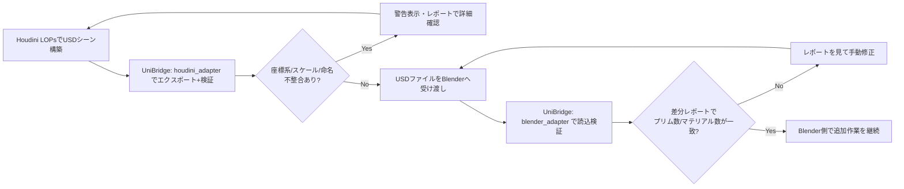
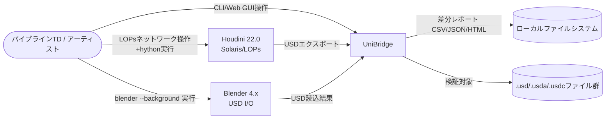
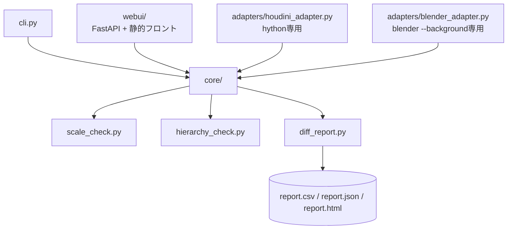
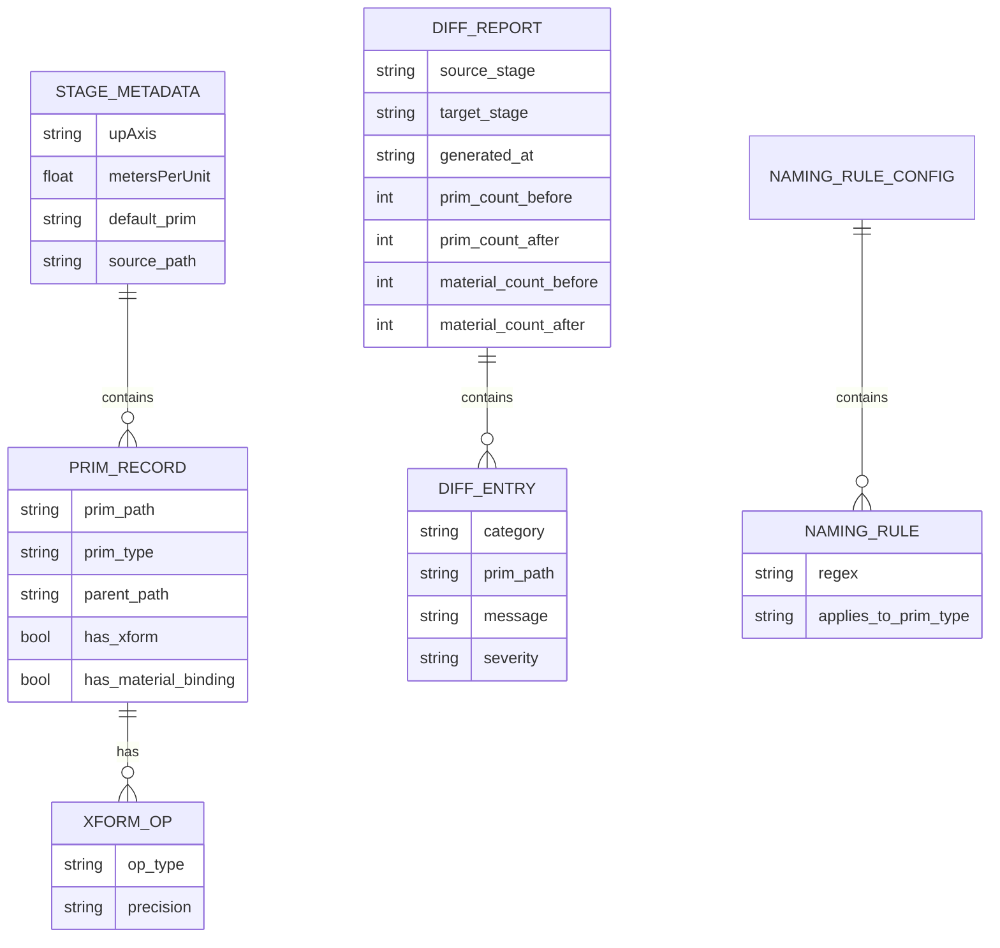
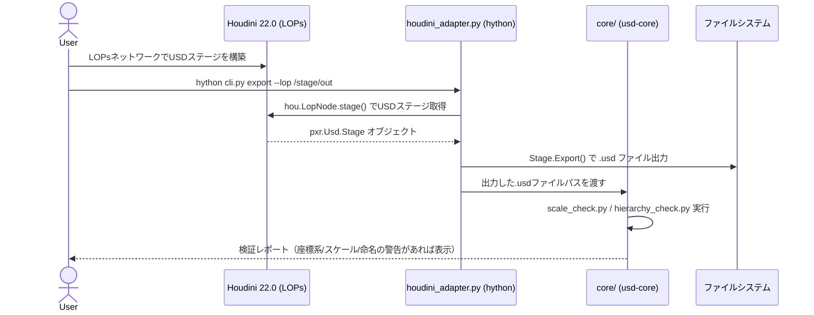
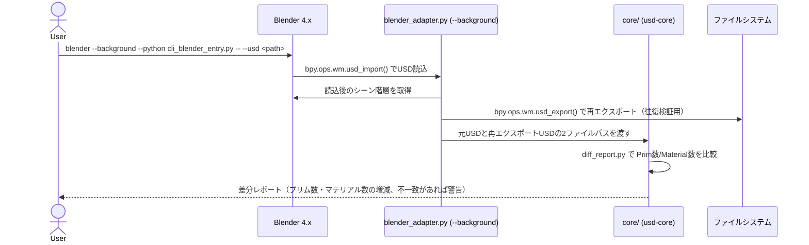

# 開発時要件定義: DCC間フォーマット変換・検証ツール「UniBridge」

| 項目 | 値 |
|------|---|
| 版 | 0.1 |
| 作成日 | 2026-09-07 |
| 最終更新 | 2026-09-07 |
| ステータス | ドラフト |
| 著者 | 金子直樹 |
| 承認者 | 金子直樹（個人開発のためセルフ承認） |
| 関連 | [仕様書](./仕様書.md) ／ 姉妹プロジェクト [Scene Doctor 要件定義書](../../scene_doctor/docs/要件定義書.md) ／ [PipeInit 要件定義書](../../pipeinit/docs/要件定義書.md) ／ [PipeBoard mini 要件定義書](../../pipeboard/docs/要件定義書.md) |
| プロジェクトタイプ | MVP / 個人開発ポートフォリオ（5本構成の⑤、差別化効果が最大級と位置づけられた最重要案件） |

> **本書の位置づけ**: 転職活動用に作成する5本のポートフォリオのうち5本目。①PipeInit・②Scene Doctor・③PipeBoard miniで確立した「DCC非依存コア + アダプタ」という設計思想を踏襲しつつ、本プロジェクトは**2つのDCC（Houdini/Blender）を1本のツールで橋渡しする**という、これまでで最も設計難度の高い構成を持つ。OpenUSD（Universal Scene Description）というDCC間相互運用フォーマットの深い理解を実装で証明することを最大の目的とする。

---

## 1. 文書管理・メタ情報

### 1.1 改訂履歴

| 版 | 日付 | 変更概要 | 承認者 |
|---|---|---|---|
| 0.1 | 2026-09-07 | 初版作成（要件定義書+仕様書+ADRを一括作成） | 金子直樹 |

### 1.2 文書の位置づけ・想定読者

- **想定読者**: 自分自身（実装リファレンス）／ポートフォリオ審査者・面接官（USDワークフロー実装経験の証明資料）。
- **参照頻度**: 実装期間中は毎日参照する。特に§1.5（USD用語集）・§4（アーキテクチャ）・§16.6（面接想定問答）は、面接でUSDの概念（レイヤー・コンポジション・Stage・Prim）をその場で深掘りされた際に、正確な語彙で答えられる密度を意図している。
- **応募スケジュールとの関係**: 本命応募締切2026-11-01、保険応募締切2026-12-01。UniBridgeは①〜③（既に実機検証済み）の後に着手する最終・最重要案件であり、スケジュールの遅延リスクが最も低い時期（本命応募直前）に完成度を最大化する位置づけとする。

### 1.3 ステータスダッシュボード

| 項目 | 状態 |
|---|---|
| 要件定義 | ✅ On target |
| 仕様書 | ✅ On target（本書とペアで完成） |
| ADR | ✅ 5本作成済み（`docs/adr/`） |
| 実装 | 未着手 |
| リリース（GitHub公開） | 未着手 |

### 1.4 関連ドキュメント

- `docs/仕様書.md`（本書とペア、実装パラメータの正本）
- `docs/adr/`（ADR-0001〜0005、本書と同時に作成）
- `.github/workflows/ci.yml`（実装フェーズで追加）
- `~/3dcg-dev/scene_doctor/docs/要件定義書.md`（設計思想の一貫性の参照元。Ports & Adaptersパターンの初出）
- `~/3dcg-dev/pipeinit/docs/要件定義書.md`（命名規則YAML設計の参照元）
- パイプライン転職ロードマップ「パイプラインエンジニア転職ポートフォリオ企画書」（5プロジェクト共通の上位計画書。①PipeInit ②Scene Doctor ③PipeBoard mini ④未定 ⑤本プロジェクト＝差別化効果最大級と評価）

### 1.5 用語集・略語集（USD用語は特に詳細に記載する）

**OpenUSD（Universal Scene Description）コア概念**

| 用語 | 説明 |
|---|---|
| USD / OpenUSD | Pixar Animation Studiosが開発し2016年にオープンソース化した、大規模3Dシーンの記述・合成・交換のためのフレームワーク兼ファイルフォーマット。単なるファイル形式ではなく、複数のレイヤーを非破壊で重ね合わせる「コンポジション」の仕組み自体を含む点が、FBX/Alembic等の単純な交換フォーマットと決定的に異なる |
| Stage | USDシーン全体を表す実行時のインメモリ表現。複数のLayerをコンポジション（合成）した結果として構築される、シーングラフの最終形。`pxr.Usd.Stage`として扱う |
| Layer | `.usd` / `.usda`（ASCII）/ `.usdc`（バイナリ）/ `.usdz`（パッケージ）として保存される、単一の名前空間定義ファイル。1つのLayerは「モデリング」「マテリアル」「リギング」等、シーンの特定の側面（aspect）のみを記述することが多い |
| Composition（コンポジション） | 複数のLayerを、Sublayer・Reference・Payload・Variant・Inherits・Specializesといった演算子（Composition Arc）で非破壊に重ね合わせ、単一のStageを構築する仕組み。USDの最大の特徴であり、本プロジェクトが「なぜUSDを選んだか」の中核をなす概念（§4.2で詳述） |
| Sublayer | 複数のLayerを強弱の順序（LayerStack）で積み重ねる仕組み。同一Prim階層に対し、上位LayerのOpinion（意見・値）が下位Layerの値を上書きする |
| Reference | 別のUSDファイル（またはStage内の別箇所）のPrim階層を、現在の階層に取り込む仕組み。アセットの再利用（同一アセットを複数箇所に配置等）に使う |
| Payload | Referenceに似るが、明示的にロードするまでシーングラフに読み込まれない遅延読込機構。数千アセット規模のシーンで、必要な部分だけを読み込む（軽量プレビュー→詳細ロード）ワークフローを可能にする |
| Variant / VariantSet | 同一Primに対する複数のバリエーション（例: LODレベル、カラーバリエーション）を1つのファイル内に格納し、切り替え可能にする仕組み |
| Prim（Primitive） | USDシーングラフを構成する基本ノード。ファイルシステムのディレクトリに相当する概念で、階層構造（`/root/geo/mesh1`のようなパス）を持つ。Xform・Mesh・Material等、様々な種別（Type）を持ちうる |
| Xform | 変換（位置・回転・スケール）情報を持つPrimの一種。Houdini/Blenderにおける「Transform（Null/Empty）ノード」に相当する |
| Attribute | Primが持つ個別の値（頂点座標、色、スケール係数等）。時間軸に沿ったアニメーション値（Time-sampled）も持てる |
| Relationship | Prim間の参照関係（例: MeshがMaterialを参照する`material:binding`）を表す |
| Opinion | あるLayerが特定のPrim/Attributeに対して持つ「値の主張」。コンポジションはLayerStackの強弱順に従い、最も強いOpinionを採用する |
| upAxis | Stageのメタデータとして持つ、上方向の軸定義（`Y`または`Z`）。DCC間でこれが異なることが、本プロジェクトが解決する主要課題の1つ（§3.1） |
| metersPerUnit | Stageのメタデータとして持つ、1ユニットが何メートルに相当するかのスケール定義（Houdiniは既定1.0=メートル、Blenderも既定1.0=メートルだが、スタジオ運用や他ソフトとの往来でcm単位系（0.01）が使われるケースがあり不整合の温床になる） |
| usd-core | Pixar公式のUSD Python/C++ライブラリを、DCCなしでpipインストール可能にした配布パッケージ（`pip install usd-core`）。`pxr`モジュール（`Usd`, `UsdGeom`, `Sdf`等）としてimportする |
| pxr | usd-coreが提供するPythonモジュール名前空間。`from pxr import Usd, UsdGeom, Sdf`のように使う |

**Houdini関連（Scene Doctorと共通の用語は再掲を最小化）**

| 用語 | 説明 |
|---|---|
| LOPs（Lighting Operators） | Houdini SolarisコンテキストのUSDネットワーク。ノードベースでStageを構築・編集する |
| Solaris | Houdini 18.5以降に搭載された、USDネイティブのルック開発・ライティング・レイアウト用コンテキスト全体の名称 |
| HOM | Houdini Object Model。Pythonから`hou`モジュール経由でHoudiniを操作するAPI体系（Scene Doctorと共通） |
| hython | Houdini同梱のPythonインタプリタ。GUIなしでバッチ実行できる（Scene Doctorと共通） |

**Blender関連**

| 用語 | 説明 |
|---|---|
| bpy | BlenderのPython API。`import bpy`でBlender内部のPythonインタプリタからシーン操作を行う |
| USD I/O | Blender標準搭載のUSDインポート/エクスポートアドオン（`bpy.ops.wm.usd_import` / `usd_export`）。Blender 3.x以降で本体に統合されている |
| `blender --background --python` | Blenderをヘッドレス（GUIなし）で起動し、指定Pythonスクリプトをバッチ実行するコマンドライン起動方式 |

**共通・比較対象フォーマット**

| 用語 | 説明 |
|---|---|
| FBX | Autodeskが管理する、長年業界標準として使われてきたDCC間交換フォーマット。単一ファイルにジオメトリ・マテリアル・アニメーションを「フラットに」格納する設計で、複数人が同一アセットの異なる側面を非破壊に重ね合わせる仕組みを持たない（§4.2で比較） |
| Alembic (ABC) | ジオメトリキャッシュ（ベイク済みアニメーション）の交換に強いフォーマット。コンポジションの概念を持たず、USDはAlembicのキャッシュ格納方式からも影響を受けている |
| 差分レポート（Diff Report） | 本プロジェクト固有語。変換前後のStageに対し、Prim数・Attribute値・Material数等を比較し、不整合を機械可読な形式で出力するもの |

### 1.6 参照標準・法令一覧

| 標準 | 版 | 適用範囲 | 適用理由 |
|---|---|---|---|
| ISO/IEC/IEEE 29148:2018 | - | 本要件定義書の章構成方針 | ドメイン知識スキル`requirements-pro`の準拠元 |
| ISO/IEC 25010 (JIS X 25010) | - | §6 非機能要件の品質特性分類 | ツール品質を業界標準の語彙で説明できるようにするため |
| OWASP Top 10:2021 | - | §12 セキュリティ（A03:インジェクション、A08:ソフトウェア/データ整合性の失敗のみ該当） | USD/YAMLファイルの安全な読込・サブプロセス実行の設計に直結 |
| OpenUSD公式仕様（Pixar Graphics Technologies, `openusd.org`） | 継続更新 | Stage/Layer/Composition/Prim等のデータモデル定義全般 | 本プロジェクトの中核技術がOpenUSDそのものであるため、公式仕様を第一級の参照標準として位置づける |
| Conventional Commits 1.0.0 | - | §15 コミット規約 | `git-workflow.md`との整合 |

> <!-- 要レビュー --> PCI DSS / GDPR / NIST SP 800-63B-4 / WCAG 2.2は、決済・個人情報を扱わず、簡易Web GUIも認証を持たないため対象外と判断する。この判断基準：「本ツールは認証・決済・個人データを扱わない」。スコープ変更時（例: マルチユーザーWeb化）に再評価する運用とする。WCAG 2.2については簡易Web GUIの範囲でアクセシビリティの基本配慮（§7）を行うが、フル準拠は求めない。

### 1.7 トレーサビリティID体系

標準の `BR- / STK- / FR- / NFR- / SEC- / IF- / LEG- / TC-` を採用する（LEG・IFは本プロジェクトでは不使用）。`TC-`は§13.2で発番し、§13.4のマトリクスと完全に対応させる。

---

## 2. ビジネス要件

### 2.1 エレベーターピッチ

Houdini SolarisとBlenderという2つのDCCの間で、OpenUSDシーンを相互変換すると、座標系（Y-up/Z-up）・スケール単位（cm/m）・階層構造・命名規則の不整合が静かに発生する。UniBridgeは、この変換前後の整合性を自動検証し、差分レポートとして可視化するツールであり、「USDワークフローにおけるDCC間ブリッジの品質保証」をコード化する。業界標準になりつつあるUSDへの深い理解と、DCC非依存のデータ交換基盤を扱える証明として、5本のポートフォリオの中で最も差別化効果が高いと位置づけている。

### 2.2 解くべき課題（定量化）

- 複数DCCを併用する制作パイプラインでは、レイアウトはHoudini、モデリング/リギングの一部はBlenderといった分業が発生しうる。この際、座標系（Y-up/Z-up）やスケール単位（cm/m）の不整合に気づかずアセットを往来させると、シーン上でオブジェクトが極端に巨大化/縮小したり、上下が反転したりする事故につながる（一般的な現場感覚に基づく仮説。本ツールでは自分で構築した検証用シーンを使い、意図的に不整合を仕込んだ変換で検出→レポート化のサイクルを実測して裏付ける）。
- 実測方法: Houdini LOPsで作成した検証用USDシーン（複数のスケール単位・座標系パターンを含む）をBlenderへ変換し、UniBridgeで検出できた不整合件数・階層構造の差分・プリム数の増減を面接時の説明材料とする（BR-005、KGI参照）。

### 2.3 ビジネスゴール（やること）と Non-Goals（やらないこと）

**やること（BR）**

| ID | 内容 |
|---|---|
| BR-001 | Houdini LOPs（Solaris）からエクスポートしたUSDステージを、Blenderで読み込み検証できることを示す |
| BR-002 | スケール単位（cm/m）・座標系（Y-up/Z-up）の不整合を自動検出し、変換・警告表示できることを示す |
| BR-003 | 階層構造（Xform/Prim）の命名規則チェックにより、DCC間往来後もパイプライン規約を維持できることを示す |
| BR-004 | 変換前後のプリム数・マテリアル数を比較する差分レポートにより、変換の正しさを客観的に検証できることを示す |
| BR-005 | CLIと簡易Web GUIの両方を提供し、開発者向け・非開発者向け双方の利用シナリオに対応できることを示す |
| BR-006 | OpenUSDのレイヤー・コンポジションという概念を正確に理解し、なぜこれがFBX等の旧来フォーマットに対して優位かを説明できることを示す（差別化ポイントの核） |

**Non-Goals（明確に対象外）**

1. USDシーン自体のフルレンダリング・ルック開発（マテリアルのシェーダーグラフ詳細検証等）は対象外。本ツールはあくまで「構造・座標系・命名の整合性検証」に限定する。
2. Houdini/Blender以外のDCC（Maya, Unreal Engine等）への直接対応は対象外。ただしUSDというフォーマット自体がDCC非依存であるため、将来的な拡張余地は仕様書§2.5で明記する。
3. 自動修正（オートフィックス）でスケール単位・座標系を書き換える機能は、明示的なユーザー承認フロー（`--apply`相当）を必須とし、無条件の自動修正は行わない（Scene DoctorのADR-0003と同一思想）。
4. マルチユーザー同時実行・認証機能を持つ本格的なWebアプリ化は対象外（簡易Web GUIはローカル実行のシングルユーザー前提）。
5. 決済・アカウント管理機能は存在しない。
6. USDの完全なComposition Arc（Payload・Variant・Inherits・Specializes全種）の網羅的サポートは対象外とし、v1はSublayer・Referenceと基本的なXform/Meshの階層検証に絞る（§2.7）。

### 2.4 KGI / KPI

```
KGI: 2026-11-01（本命）／2026-12-01（保険）までにCGパイプラインエンジニアとして転職成功する
     （本プロジェクトは5本のポートフォリオのうち最も差別化効果が高いとされる5本目）

KPI（本プロジェクト固有）:
  - Houdini LOPsで構築した検証用USDシーン（スケール単位・座標系の異なる複数パターンを含む）を
    Blenderへ変換し、UniBridgeが不整合を検出できることを実演できる ≥ 3パターン
    （cm/m不一致、Y-up/Z-up不一致、命名規則違反の組み合わせ）
  - 変換前後の差分レポート（プリム数・マテリアル数比較）を1操作でCLI/Web双方から生成できる
  - pytestカバレッジ80%以上（DCC非依存のcore/層、CI上で計測）
  - core/層がHoudini/Blenderいずれのアダプタにも依存しないことを、adapter層を一切importせずに
    pytestが完結することで実証する
  - README/仕様書内で「なぜUSDを選んだか（FBXとの比較）」を、面接でそのまま使える言語化として
    完成させる
```

### 2.5 ROI / 収益モデル

該当なし（収益を目的としない個人開発ポートフォリオ）。ROIは「転職成功による年収差分」という間接指標のみで捉え、本書では扱わない。

### 2.6 主要機能サマリ（トップ5）

1. Houdini LOPsからのUSDステージエクスポート、Blenderでの読込検証
2. スケール単位(cm/m)・座標系(Y-up/Z-up)の自動検出・変換・不整合警告
3. 階層構造(Xform/Prim)の命名規則チェック
4. 変換前後のプリム数・マテリアル数を比較する差分レポート出力
5. CLIと簡易Web GUI両対応

### 2.7 システム化の範囲とOut of Scope

- **範囲内**: usd-core（`pxr`モジュール）を用いたUSDステージの読込・検証・差分比較ロジック（DCC非依存のcore層）、Houdini HOM/LOPs経由のエクスポート・検証（houdini_adapter）、Blender bpy/USD I/O経由の読込検証（blender_adapter）、CLIおよび簡易Web GUIによる操作。
- **Out of Scope**: §2.3のNon-Goals全項目。特に「フルレンダリング検証」「Maya/UE直接対応」「自動修正の無条件実行」「本格Webアプリ化」は将来拡張の候補としてREADMEに明記するに留める。

### 2.8 前提条件・制約事項

| 区分 | 内容 |
|---|---|
| 技術 | Houdini 22.0 Indie/Education、Blender 4.x系（LTS想定）固定。バージョン差異による挙動変化は保証範囲外 |
| 予算 | 追加コストなし（既存のHoudini/Blenderライセンス・開発機材を流用。Blenderは無償） |
| 法令 | 該当なし（決済・個人情報を扱わないため） |
| リソース | 開発者1名（金子直樹）。外注なし |
| **重要な制約** | ①〜③（PipeInit / Scene Doctor / PipeBoard mini）は既に実機動作確認済みでGitHub公開済み。本プロジェクトはそれらの設計思想（Ports & Adapters、hou依存の分離）を踏襲しつつ、2アダプタ構成という新しい課題に取り組む（§4.2、ADR-0002で設計上の違いを詳述） |
| **本書のスコープ** | 本タスクは要件定義書・仕様書・ADRの作成のみであり、実装は行わない。実機検証結果・ベンチマーク数値は実装後に別途追記する（§13, §16.6に明記） |

### 2.9 ステークホルダー定義

| ID | ステークホルダー | 役割・関心事 |
|---|---|---|
| STK-001 | 金子直樹（開発者兼利用者） | 実装・動作確認・面接での説明責任 |
| STK-002 | ポートフォリオ審査者・面接官 | USDワークフロー実装経験・設計思想の評価 |
| STK-003 | （想定読者としての）スタジオのパイプラインTD | 複数DCC間のUSD往来を実際の制作パイプラインでどう運用しうるかの評価軸として仮想的に設定 |

### 2.10 予算計画

追加費用なし。Houdini Indie/Educationライセンス・Blender（無償）・開発機材は既存資産を流用する。

### 2.11 体制

開発者1名がPM・設計・実装・テスト・ドキュメント作成のすべてを担う。外注領域なし。レビューアは自分自身（セルフレビュー）とし、`/code-review`（組込コマンド）で客観性を補う。

### 2.12 マスタースケジュール

> 本書は要件定義書・仕様書・ADRの作成フェーズの成果物である。実装フェーズのスケジュールは、①〜③の開発ペース（各3週間程度）を参考に、実装着手時に別途確定する。参考として想定フェーズ構成のみ以下に示す（<!-- 要レビュー: 着手時に確定 -->）。

| フェーズ（想定） | 内容 |
|---|---|
| Phase 1 | core/（DCC非依存のUSD検証ロジック: scale_check.py, hierarchy_check.py, diff_report.py）の実装、pytestでのTDD |
| Phase 2 | houdini_adapter.py（LOPsエクスポート）・blender_adapter.py（USD I/O読込検証）の実装、hython/blender実機での手動検証 |
| Phase 3 | cli.py・webui/（簡易Web GUI）の実装、検証用USDシーン（複数の不整合パターン）でのBefore/After実演、README・ドキュメント整備、GitHub公開 |

---

## 3. 業務要件

### 3.1 As-Is業務フロー（DCC間の手動データ受け渡しで起きる事故の具体例）

複数DCCを併用する制作パイプラインでは、あるアーティストがHoudini Solaris上でレイアウト・シミュレーション済みのシーンをUSDとしてエクスポートし、別のアーティストがBlenderでモデリング/リギングの追加作業を行う、といった往来が発生しうる。この際、以下のような事故が典型的に起きる。

- **スケール単位の不一致**: HoudiniのStageが`metersPerUnit=1.0`（メートル単位）でエクスポートされたのに対し、Blender側の別アセットが`metersPerUnit=0.01`（センチメートル単位）で作られていた場合、両者を同一シーンに配置すると一方が100倍のサイズで表示され、目視で気づくまで放置される。
- **座標系の不一致**: HoudiniはY-up（Y軸が上方向）が標準だが、Blenderはネイティブでは Z-up（Z軸が上方向）である。USD自体は`upAxis`メタデータで軸を明示できるが、エクスポート/インポート時の変換設定を誤ると、オブジェクトが横倒しになったまま気づかれずレイアウトが進む。
- **階層構造・命名の齟齬**: HoudiniのLOPsネットワークで`/geo/char_hero`という命名だったPrimが、Blender側の別チームの命名規則（例: `SM_CharHero`）と食い違ったまま往来し、パイプラインの自動化スクリプト（パス名に依存するリグバインド等）が壊れる。
- これらの事故は、レンダー直前や合成（Comp）フェーズで初めて発覚することが多く、Scene Doctorが解決するジオメトリ品質の問題と同様に「発見が遅れるほど手戻りコストが増大する」という構造を持つ。

### 3.2 To-Be業務フロー

Houdini LOPsからUSDをエクスポートする段階、およびBlenderで読み込む段階の両方でUniBridgeを実行し、スケール単位・座標系・命名規則の不整合を自動検出・警告する。差分レポートにより、変換前後でプリム数・マテリアル数が意図通り保たれているかを客観的に確認できる。



### 3.3 業務ルール・制約・例外パターン

- 検証はUSDステージ・シーンの**読み取り専用**操作として行うことを既定とする。座標系・スケール単位の自動変換は、明示的なユーザー承認（`--apply`フラグまたはWeb GUIの確認ダイアログ）を経て初めて実行する。
- 検証対象外にしたいPrim（意図的に規約外の命名を許容する一時的な作業用Prim等）は、命名規則YAMLの除外パターンで指定できるようにする（仕様書§7で詳細化、PipeInit/Scene Doctorと同じ設計判断を踏襲）。
- USDの`upAxis`・`metersPerUnit`メタデータが未設定（デフォルト値に依存）の場合も「暗黙の不整合リスク」として警告対象に含める（明示されていないことそのものが事故の温床であるため）。

### 3.4 ペルソナ

```
名前: 佐藤ミサキ（仮）
役職: 中規模スタジオのパイプラインTD（3年目）
ITリテラシー: Python/USDのAPIをある程度読み書きできるが、コンポジションの詳細挙動は都度ドキュメントを参照するレベル
利用デバイス: スタジオ支給のLinux/Windowsワークステーション
利用コンテキスト: HoudiniとBlenderを併用するプロジェクトで、USDアセットの往来時に発生する不整合の調査・修正を担当している
ジョブ（JTBD）: 「DCCを跨いだ後、何が変わってしまったのかを目視ではなく機械的に確認したい」
ペイン: 座標系やスケールのズレを目視で気づくのに時間がかかり、レイアウト作業が進んだ後に発覚すると手戻りが大きい
ゲイン: 変換直後に自動レポートで差分を確認でき、問題を最小限のタイミングで潰せる
```

### 3.5 カスタマージャーニーマップ

| ステージ | 内容 |
|---|---|
| 認知 | パイプラインチームの共有リポジトリでUniBridgeの存在を知る |
| 導入 | CLIで手元のUSDファイル1つに対し検証を実行し、挙動を理解する |
| 定常利用 | Houdini→Blenderの往来のたびに、エクスポート後・インポート後の2箇所で実行する定型作業として組み込む |
| 拡張利用 | 簡易Web GUIで複数ファイルの差分レポートをまとめて確認し、非開発者のアーティストにも結果を共有する |

### 3.6 オンボーディング要件

CLIは`--help`で全オプションを表示し、簡易Web GUIはトップページに「USDファイルをドラッグ&ドロップして検証」という単一の導線のみを用意し、初回利用時に迷わないようにする（詳細は仕様書§6）。

### 3.7 業務トランザクション一覧

| トランザクション | 内容 |
|---|---|
| Houdiniエクスポート検証 | LOPsネットワークからUSDをエクスポートし、直後に座標系・スケール・命名を検証 |
| Blenderインポート検証 | Blenderで読み込んだUSDに対し、階層構造・命名を検証 |
| 差分比較 | 変換前（Houdini側の元USD）と変換後（Blenderで読み込み再エクスポートしたUSD等）のプリム数・マテリアル数を比較 |
| バッチ変換検証 | 複数USDファイルに対し一括で検証・差分レポートを生成（§11） |

### 3.8 業務頻度・繁閑差

個人開発ポートフォリオのため実運用頻度は想定しないが、設計上は「DCC間でアセットが往来するたびに実行される」中頻度・低〜中負荷（1ファイルあたり数秒〜数十秒、プリム数に依存）の利用を想定する。

---

## 4. システム要件・アーキテクチャ

### 4.1 動作環境

| 項目 | 内容 |
|---|---|
| Houdini | 22.0 Indie / Education 固定（Solaris/LOPsコンテキストを使用） |
| Blender | 4.x系（LTS版を推奨、USD I/Oアドオンが標準搭載されているバージョン） |
| Python（core層・CLI・Web GUI） | 3.11以上、`usd-core`パッケージ（`pxr`モジュール） |
| Python（houdini_adapter実行環境） | Houdini同梱のhython（Houdini 22.0のビルドに準拠） |
| Python（blender_adapter実行環境） | Blender同梱のPython（`blender --background --python`経由） |
| OS | macOS（開発機）。Windows/Linuxでの動作は`pathlib`ベースの実装により理論上可能だが検証範囲外とする |
| 実行方式 | (a) `hython`経由でHoudini LOPsからのエクスポート・検証、(b) `blender --background --python`経由でのBlender読込検証、(c) `usd-core`のみで完結するcore層の単体CLI実行、(d) 簡易Web GUI |

### 4.2 アーキテクチャ方式（Ports & Adaptersの発展形: 2アダプタ構成）

**設計思想の一貫性**: Scene Doctorで確立した「DCC非依存コア + アダプタ」というPorts & Adaptersパターンを継承する。Scene Doctorは`hou`という単一DCCへの依存をアダプタ層に閉じ込める1アダプタ構成だったが、UniBridgeは**Houdini（`hou` HOM）とBlender（`bpy`）という2つの異なるDCC APIへの依存を、それぞれ独立したアダプタに閉じ込める2アダプタ構成**である点が設計上の最大の違いである。

**なぜ2アダプタが必要か（USD自体はDCC非依存フォーマットなのに、なぜHoudini/Blenderの実シーンデータをアダプタ越しに使うのか）**: USD自体（`.usd`/`.usda`/`.usdc`ファイルとそのコンポジション）は、`usd-core`（`pxr`モジュール）だけで読み書き・検証が完結する、完全にDCC非依存なデータである。したがって「USDファイル同士の比較・検証」だけならアダプタは不要である。しかし本プロジェクトが検証すべき不整合（座標系・スケール単位の不一致）は、**「HoudiniのLOPsネットワークが実際にどうUSDをエクスポートするか」「Blenderの USD I/Oが実際にどうUSDを解釈してシーンに反映するか」というDCC側の変換挙動そのもの**に起因する。したがって、DCC実機を経由した実際のエクスポート/インポート結果を検証対象に含める必要があり、そのためにHOM（`hou.LopNode`等）・bpy（`bpy.ops.wm.usd_import`等）というDCC APIとの接続部分だけをアダプタ層に閉じる設計とした。**core/層はUSDそのもの（`pxr`モジュール）にのみ依存し、`hou`/`bpy`を一切importしない**という境界を厳格に維持する（ADR-0002）。

```mermaid
flowchart TB
  subgraph Houdiniプロセス内のみ hython
    HOU[hou モジュール\nHOM/LOPs]
    HADAPTER[adapters/houdini_adapter.py\nLOPsからのUSDエクスポート]
  end
  subgraph Blenderプロセス内のみ blender --background
    BPY[bpy モジュール\nUSD I/O]
    BADAPTER[adapters/blender_adapter.py\nUSD読込検証]
  end
  subgraph DCC非依存 pytest対象 usd-core のみに依存
    CORE[core/\nscale_check.py / hierarchy_check.py / diff_report.py]
    IFACE[core/interfaces.py\nUSD Stageを直接扱う純粋関数群]
  end
  HOU --> HADAPTER
  HADAPTER -->|USDファイルとして出力| CORE
  BPY --> BADAPTER
  BADAPTER -->|USDファイルとして出力| CORE
  CORE --> REPORT[diff_report.py\n差分レポート]
```

### 4.3 C4 Model

**Context図**



**Container図**



### 4.4 技術スタック確定表

| カテゴリ | 採用 | バージョン | 選定理由 | 代替案 | 却下理由 |
|---|---|---|---|---|---|
| データ交換フォーマット | OpenUSD | Houdini 22.0/Blender 4.x同梱版準拠 | レイヤー・コンポジションによる非破壊合成が可能な業界標準の相互運用フォーマット。§4.2・ADR-0003で詳述するFBXとの比較が選定の核 | FBX | 単一ファイルにフラットに格納する設計で、複数人が同一アセットの別側面（モデル/マテリアル/リギング）を非破壊に重ね合わせる仕組みを持たない |
| USD Pythonライブラリ | usd-core | pip最新安定版 | DCCなしでpipインストールでき、core/層をhou/bpy非依存に保てる（`pxr`モジュール） | 各DCC同梱のUSD API直接利用 | DCCプロセス外でのテスト（pytest）が不可能になり、Ports & Adaptersの原則（ADR-0001由来）に反する |
| DCC(1) | Houdini | 22.0 Indie/Education | Solaris/LOPsが標準搭載され、USDネイティブなノードベース編集が可能。既存資産（Scene Doctorの実行基盤）を流用できる | - | - |
| DCC(2) | Blender | 4.x系 | USD I/Oが本体標準搭載、無償でライセンス制約がなく検証環境を再現しやすい | Maya | ライセンス費用が個人開発に見合わず、USD I/Oも標準搭載ではない（プラグイン依存） |
| 言語 | Python | 3.11+ | usd-core・HOM・bpyいずれもPythonバインディングを持ち、単一言語で3層（core/houdini_adapter/blender_adapter）を統一できる | - | - |
| CLI | argparse | 標準ライブラリ | Scene Doctorの`scene_doctor_cli.py`のパターンを踏襲し、外部依存を増やさない | Click（PipeInitで採用） | 姉妹プロジェクトで両方式の実装経験を示す意図的な選択の分散（PipeInit=Click、UniBridge=argparseでScene Doctorパターンを踏襲） |
| Web GUI | FastAPI + 静的HTML/fetch | FastAPI最新安定版 | PipeBoard miniのNext.jsほど本格的なフロントは過剰と判断（§7.1で理由を詳述）。差分レポート表示という単純な情報表示に留まるため | Next.js | SPA的な複雑な状態管理・ルーティングを必要とせず、フル構成のオーバーヘッドがROIに見合わない |
| テスト | pytest | 8.x系 | Houdini/Blenderライセンス・実機なしでもcore/層をCI実行可能 | unittest | fixture/parametrizeの表現力で劣る |
| 設定 | YAML | PyYAML | 命名規則をスタジオごとに切り替え可能にする（PipeInit/Scene Doctorと同じ設計判断を踏襲） | JSON | コメント記述ができずルールファイルとしての可読性で劣る |

### 4.5 環境構成

環境は`local`のみ（Houdini実行環境 + Blender実行環境 + usd-coreのみのPython venv、の3実行経路）。CI（GitHub Actions）はHoudini/Blenderいずれのライセンス・実機も持たないため、`core/`のusd-core依存部分のみをpytestで実行し、`adapters/houdini_adapter.py` / `adapters/blender_adapter.py`の動作確認は手動E2Eに委ねる（Scene Doctorと同一方針、§13.1）。

### 4.6 12-Factor準拠チェック（簡易）

Webサービスではないため大半の因子は直接適用されないが、精神は踏襲する。

| 因子 | 適用状況 |
|---|---|
| 設定 | 命名規則・スケール単位の既定値等はYAMLファイルで外部化 |
| 依存関係の明示 | `pyproject.toml`で`usd-core`等の依存を明示（§3.1で全文） |
| ログ | 標準出力へのログ出力とし、ファイル保存はレポート出力機能に限定 |
| 並行性 | バッチ処理のワーカー並列度で表現（§11） |
| （その他多くの因子） | Webサービス特有の因子（バックエンドサービス・ポートバインディング等）は簡易Web GUIの範囲でのみ部分適用 |

### 4.7 データモデル（USD Stage/Prim/Xform等の内部データモデル）



上記データモデルは仕様書§4のスキーマ定義（Pythonデータクラス全文）の正本ではなく、概念モデルとして位置づける。実装レベルの定義は仕様書側に集約する。

### 4.8 データボリューム見積

| シナリオ | Prim数 | ファイルサイズ目安 | 想定実行時間（NFR-001目標） |
|---|---|---|---|
| 小規模（単体アセット検証） | 〜100 | 〜数百KB | 2秒以内 |
| 中規模（ショット単位のレイアウトシーン想定） | 〜2,000 | 〜数MB | 15秒以内 |
| 大規模（プロダクション相当、数千アセット規模） | 〜数万 | 〜数百MB | 未保証（本プロジェクトのスコープ外。§11でバッチ処理化・CI組み込みによる規模対応方針を明記） |

### 4.9 シーケンス図

**Houdini LOPs → USD → Blender の変換フロー（往路: エクスポート検証）**



**Blenderでの読込検証フロー（復路: インポート検証+差分比較）**



### 4.10 ADR運用方針

`docs/adr/NNNN-decision-title.md` にMichael Nygard形式で記録する。

| ADR | タイトル | ステータス |
|---|---|---|
| ADR-0001 | データ交換フォーマットにOpenUSDを採用（FBXとの比較） | Accepted（本文は仕様書§14.2、独立ファイル`docs/adr/0001-adopt-usd-over-fbx.md`） |
| ADR-0002 | Ports & Adaptersの発展形として2アダプタ構成を採用 | Accepted（本文は仕様書§14.3、独立ファイル`docs/adr/0002-dual-adapter-architecture.md`） |
| ADR-0003 | Blender bpy経由での実シーン階層検証を行う設計 | Accepted（本文は仕様書§14.4、独立ファイル`docs/adr/0003-bpy-for-scene-hierarchy-validation.md`） |
| ADR-0004 | CLIと簡易Web GUIの両方を提供する設計 | Accepted（本文は仕様書§14.5、独立ファイル`docs/adr/0004-cli-and-web-gui.md`） |
| ADR-0005 | 自動修正ではなく検証+提示に留める設計 | Accepted（本文は仕様書§14.6、独立ファイル`docs/adr/0005-report-only-no-autofix.md`） |

### 4.11 クラウドポータビリティ

該当なし（Houdini/Blenderライセンス・ローカル実行環境に紐づくツールであり、クラウド展開を想定しない）。ただし簡易Web GUI（FastAPI）自体はコンテナ化すれば移植性を持ちうる点をREADMEの将来拡張に触れる程度に留める。

---

## 5. 機能要件

### 5.1 機能一覧

| ID | 機能 | 優先度 |
|---|---|---|
| FR-001 | Houdini LOPsからのUSDステージエクスポート | Must |
| FR-002 | Blenderでの読み込み検証 | Must |
| FR-003 | スケール単位(cm/m)・座標系(Y-up/Z-up)の自動検出・変換・不整合警告 | Must |
| FR-004 | 階層構造(Xform/Prim)の命名規則チェック | Must |
| FR-005 | 変換前後のプリム数・マテリアル数を比較する差分レポート出力 | Must |
| FR-006 | CLIインターフェース | Must |
| FR-007 | 簡易Web GUI | Should |
| FR-008 | 複数アセット一括変換検証（バッチ処理） | Should |

### 5.2〜5.3 アカウント・権限機能／権限マトリクス

該当なし（単一ユーザー・ローカル実行のツールであり、アカウント・権限の概念を持たない。簡易Web GUIも認証なしで動作する前提とする、§10）。

### 5.4 機能詳細

```markdown
### FR-001 Houdini LOPsからのUSDステージエクスポート

- **優先度**: Must
- **関連BR**: BR-001, BR-006
- **Description**: 指定LOPノード（通常は最終出力に近いノード）のUSDステージを取得し、`.usd`/`.usda`ファイルとしてエクスポートする
- **Inputs**:
  | パラメータ | 型 | 必須 | 既定値 | バリデーション |
  |---|---|---|---|---|
  | lop_node_path | node path | ◯ | - | LOPノードでなければE003 |
  | output_path | path | ◯ | - | 拡張子が.usd/.usda/.usdcでなければE002 |
  | export_format | choice(usda/usdc) | - | usda（可読性優先） | - |
- **Processing**:
  1. `adapters/houdini_adapter.py`が`lop_node_path`のノードを取得し、`hou.LopNode.stage()`でUSDステージ（`pxr.Usd.Stage`）を取得する
  2. Stageのメタデータ（`upAxis` / `metersPerUnit`）を読み取り、未設定の場合は「暗黙値に依存している」旨のWarningを記録する
  3. `stage.Export(output_path)`で指定パスへ出力する
  4. core/層へ出力パスを渡し、後続の検証（FR-003, FR-004）を実行可能にする
- **Outputs**:
  - 成功時: エクスポート済みUSDファイルパス + Stageメタデータサマリ
  - 失敗時: エラーコード（E001〜E005）
- **UseCase**: Houdini側の作業完了後、Blenderへ受け渡す前のエクスポート
- **受入条件（AC）**:
  1. 有効なLOPノードを指定した場合、指定パスにUSDファイルが生成される
  2. LOPノードでないノードを指定した場合E003で早期終了する
  3. `upAxis`/`metersPerUnit`が未設定のステージでは、暗黙値依存の警告がレポートに含まれる
  4. `export_format=usda`（既定）の場合、出力ファイルがテキストで可読であることを確認できる

### FR-002 Blenderでの読み込み検証

- **優先度**: Must
- **関連BR**: BR-001
- **Description**: 指定USDファイルをBlenderの`bpy.ops.wm.usd_import`で読み込み、読込後のシーン階層をcore/層で検証可能な形式に変換する
- **Inputs**:
  | パラメータ | 型 | 必須 | 既定値 |
  |---|---|---|---|
  | usd_path | path | ◯ | - |
  | reexport_for_diff | bool | - | true（差分検証のため読込直後に再エクスポートする） |
- **Processing**:
  1. `adapters/blender_adapter.py`が`bpy.ops.wm.usd_import(filepath=usd_path)`で読込む
  2. 読込後のBlenderシーン階層（`bpy.data.objects`）を走査し、階層構造・命名情報を取得する
  3. `reexport_for_diff`が真の場合、`bpy.ops.wm.usd_export()`で別ファイルへ再エクスポートし、元ファイルとの比較用データとする
  4. core/層へ元USDパスと再エクスポートUSDパスの2つを渡す
- **Outputs**: 読込後の階層サマリ + （reexport時）再エクスポートUSDファイルパス
- **UseCase**: Houdini側からのUSDをBlenderで受け取った直後の検証
- **受入条件（AC）**:
  1. 正常なUSDファイルを指定した場合、Blenderシーンへの読込が成功し階層サマリが取得できる
  2. 存在しない/破損したUSDファイルを指定した場合E001で早期終了する
  3. `reexport_for_diff=true`の場合、再エクスポートファイルが生成され、FR-005の差分比較に利用できる

### FR-003 スケール単位・座標系の自動検出・変換・不整合警告

- **優先度**: Must
- **関連BR**: BR-002
- **Description**: 2つのUSDステージ（またはHoudini側/Blender側それぞれのステージ）の`upAxis`・`metersPerUnit`メタデータを比較し、不一致があれば警告する。ユーザーが明示承認した場合のみ、一方の値に合わせる変換（座標変換行列の適用・スケール係数の乗算）を実行する
- **Inputs**:
  | パラメータ | 型 | 必須 | 既定値 |
  |---|---|---|---|
  | source_usd | path | ◯ | - |
  | target_usd | path | ◯ | - |
  | apply_conversion | bool | - | false（既定は警告のみ、変換は明示承認時のみ） |
- **Processing**:
  1. `core/scale_check.py`が両ステージの`GetMetadata("upAxis")` / `GetMetadata("metersPerUnit")`を取得する
  2. 未設定の場合はUSD既定値（`upAxis`未設定時は`Y`、`metersPerUnit`未設定時は`1.0`）を採用しつつ、「暗黙依存」フラグを立てる
  3. 両者が不一致の場合、`severity=warning`の差分エントリを生成する
  4. `apply_conversion=true`の場合のみ、Y-up⇔Z-up行列変換およびcm⇔m単位変換を実際に適用した新規USDファイルを生成する（計算式は仕様書§8で詳述）
- **Outputs**: 不整合警告リスト（成功時は0件） + （apply_conversion時）変換済みUSDファイル
- **UseCase**: DCC間往来時の座標系・スケール事故の予防
- **受入条件（AC）**:
  1. 両ステージの`upAxis`が一致する場合、座標系の警告は出ない
  2. 一方がY-up、他方がZ-upの場合、警告として検出される
  3. `metersPerUnit`が10倍以上異なる場合、severity=errorとして重大度を上げて報告する（誤って100倍スケールで配置される典型事故を強調するため）
  4. `apply_conversion=false`（既定）の場合、いかなる変換も実行されず警告のみで完了する
  5. `apply_conversion=true`の場合、変換後ファイルの`upAxis`/`metersPerUnit`がtarget側と一致することを確認できる

### FR-004 階層構造(Xform/Prim)の命名規則チェック

- **優先度**: Must
- **関連BR**: BR-003
- **Description**: YAML定義された命名規則（正規表現）に違反するPrim（Xform/Mesh等）を検出し、レポートする
- **Inputs**:
  | パラメータ | 型 | 必須 | 既定値 |
  |---|---|---|---|
  | usd_path | path | ◯ | - |
  | naming_rules_path | path | - | `rules/default.yaml` |
- **Processing**:
  1. `naming_rules_path`を`yaml.safe_load`で読込（SEC-001）
  2. Stage内の全PrimをTraverse（`stage.Traverse()`）し、Prim種別ごとに対応する命名規則と照合する
  3. いずれのパターンにも一致しないPrimを違反として記録する
- **Outputs**: 違反Prim一覧（Primパス・種別・違反理由）
- **UseCase**: DCC間往来後もパイプライン規約が維持されているかの確認
- **受入条件（AC）**:
  1. 規則を満たすPrim名は違反として検出しない
  2. 違反Primごとに理由（適用された規則・実際の値）が記録される
  3. 命名規則YAMLの構文エラー時はE004で早期終了する

### FR-005 変換前後のプリム数・マテリアル数を比較する差分レポート出力

- **優先度**: Must
- **関連BR**: BR-004
- **Description**: 2つのUSDステージ（変換前/変換後）に対し、Prim数・Material数（`UsdShade.Material`型Primの数）・Xform数を比較し、差分をレポートする
- **Inputs**:
  | パラメータ | 型 | 必須 | 既定値 |
  |---|---|---|---|
  | before_usd | path | ◯ | - |
  | after_usd | path | ◯ | - |
  | output_format | choice(csv/json/html/all) | - | all |
- **Processing**:
  1. `core/diff_report.py`が両ステージをTraverseし、Prim種別ごとのカウントを集計する（アルゴリズムは仕様書§8）
  2. 差分（増減）を`DiffEntry`のリストとして生成する
  3. `output_format`に応じてCSV/JSON/HTMLへ出力する
- **Outputs**: `diff_report.csv` / `.json` / `.html`
- **UseCase**: 変換の正しさを客観的に検証する
- **受入条件（AC）**:
  1. Prim数・Material数が完全一致する場合、差分0件で報告される
  2. 意図的にPrimを削除したafter_usdを用意した場合、削除されたPrimパスが差分として検出される
  3. HTML出力は、実行環境にブラウザがなくても中身がテキストとして確認できるプレーンなHTML構造とする

### FR-006 CLIインターフェース

- **優先度**: Must
- **関連BR**: BR-005
- **Description**: `cli.py`（core層+usd-coreのみで完結する検証コマンド）、Houdini/Blender実行用の別エントリポイントを通じて全機能をコマンドラインから実行できるようにする
- **受入条件（AC）**: 仕様書§5.5参照。終了コード規約はScene Doctorのパターンを踏襲する（0=違反なし、1=違反あり、10番台=エラー）

### FR-007 簡易Web GUI

- **優先度**: Should
- **関連BR**: BR-005
- **Description**: USDファイルをアップロード（または既存ファイルパス指定）し、差分レポート・不整合警告をブラウザで閲覧できる最小限のWeb UIを提供する
- **受入条件（AC）**: 仕様書§6参照

### FR-008 複数アセット一括変換検証（バッチ処理）

- **優先度**: Should
- **関連BR**: BR-005
- **Description**: 指定ディレクトリ配下の複数USDファイルに対し、FR-003〜005相当の検証を一括実行し、集約レポートを生成する
- **受入条件（AC）**: 仕様書§10（async-and-batch）参照
```

### 5.5 業務ロジック・計算式

仕様書§8（business-logic）を正本とする。座標系変換（Y-up⇔Z-up行列変換）・スケール単位変換（cm⇔m）・差分検出アルゴリズムはコードレベルの詳細を要するため仕様書側に集約する。

### 5.6〜5.11

該当なし。検索機能・ファイルアップロード（簡易Web GUIのUSDアップロードはFR-007に含める）/通知・帳票出力（差分レポートがこれに相当しFR-005に含める）・問い合わせ機能は、単一ユーザーのローカル実行CLI/簡易Web GUIという性質上、独立した実体を持たない。

### 5.12 管理画面要件

該当なし（単一ユーザー・ローカル実行のため管理者向け画面は不要）。

### 5.13 エラー・例外処理方針

| エラーコード | 意味 |
|---|---|
| E001 | 対象USDファイルが存在しない、または読み込めない（破損・非対応フォーマット） |
| E002 | 不正なパラメータ値（出力パスの拡張子不正等） |
| E003 | 指定ノードが期待する種別（LOPノード等）でない |
| E004 | 命名規則YAMLの構文エラー・必須キー欠落 |
| E005 | 出力先ディレクトリへの書き込み権限がない |

すべてのエラーはユーザー向けメッセージ（何が起きたか・どう直すか）と、`--verbose`相当のフラグ時のみ表示する開発者向けスタックトレースを分離する（Scene Doctorと同一方針）。

---

## 6. 非機能要件（IPA + ISO 25010）

> IPA非機能要求グレード選定: **グレード1（基本）**。個人向け無料ツールであり、決済・医療・金融のような社会的影響度の高い用途を想定しないため。

### 6.1 性能要件

```
NFR-001 単一USDファイル検証性能
- 対象: Prim数2,000規模のUSDステージ
- 目標: 全チェック（FR-003〜005）の実行が15秒以内

NFR-002 バッチ処理のスケーラビリティ
- 対象: 10ファイルの一括バッチ検証
- 目標: 並列実行時、逐次実行に対し合計処理時間を40%以上短縮
```

### 6.2 リソース使用（保守運用性の一部として明記）

```
NFR-003 メモリ使用量
- houdini_adapter / blender_adapterのサブプロセス1つあたりのメモリ使用量が3GBを超えないことを目安とする
- 測定方法は実装後にtests/benchmark.py相当のスクリプトで計測し、本セクションを更新する
```

### 6.3 保守運用性

```
NFR-004 テスト容易性
- core/配下のロジックはhou/bpy非依存であり、Houdini/Blenderライセンス・実機がない環境
  （GitHub Actions等）でもpytestが完結すること
```

### 6.4 移植性

```
NFR-005 DCCバージョン互換性の明示
- Houdini 22.0系・Blender 4.x系のみサポート対象とする。異なるバージョンでの動作は未検証・未保証と明記する
```

### 6.5〜6.8 可用性・ユーザビリティ・エコロジー・信頼性

いずれも個人向けローカルツールの性質上、SLA・多言語対応・CO2排出計測等の重点度は低いと判断し、最小限の記述に留める（重点度マトリクスでMVP/PoCは★☆☆と整理）。

### 6.9 互換性

```
NFR-006 USDファイル形式互換性
- .usda（ASCII）/ .usdc（バイナリ）両方の読込・出力に対応する
- .usdz（パッケージ形式）は読込のみ対応し、出力（パッケージング）はv1スコープ外とする
```

### 6.10 性能要件の測定方法

NFR-001/002は自己申告の目標値ではなく、実装後に以下の方法で実測・検証する（Scene Doctorと同一方針を踏襲）。

```
測定スクリプト: tests/benchmark.py（core/層のみusd-coreで実行、Houdini/Blender実機は含めない）
測定条件: sample_scenes/配下に生成した中規模フィクスチャUSD（Prim数2,000相当）
CI組み込み: 手動実行のみ（大規模フィクスチャの生成・実行に時間を要するためCI環境では自動化しない）
合格基準: NFR-001（15秒以内）を3回中2回以上満たす
<!-- 要レビュー: 実装後、実測値でNFR-001/002/003の数値目標を検証し、本セクションを更新すること -->
```

---

## 7. デザイン・UI/UX要件

本ツールは基本的にCLI中心のツールだが、FR-007により最小限の簡易Web GUIを提供する。フル機能のWebアプリケーションを想定した重厚なデザインシステムは不要と判断する（重点度マトリクスでMVPは★★☆、GUIを持つ分Scene Doctorより一段階重視）。

- **基本方針**: 「USDファイルをアップロード → 検証結果（不整合警告・差分レポート）を表示」という単一フローに絞り、ナビゲーション・複数ページ遷移を持たない1ページ構成とする。
- **配色・タイポグラフィ**: PipeBoard miniで使用したTailwind CSSベースの配色・コンポーネントパターンを流用し、独自デザインシステムのゼロ構築は行わない。
- **アクセシビリティ**: フォーム要素への`label`付与、エラーメッセージのテキスト表示（色のみに依存しない）程度の基本配慮を行うが、WCAG 2.2のフル準拠は求めない（§1.6の判断基準を継承）。
- **多言語対応**: 日本語のみ。i18nフレームワークは導入しない。
- 画面仕様の詳細は仕様書§6「screen-spec」に記載する。

---

## 8. マーケティング・SEO・グロース要件

対象外（決済・集客を目的としないポートフォリオツールのため、SEO・グロース施策の実体を持たない）。ただし「ポートフォリオとしての見せ方」という観点では以下を意識する。

- READMEにBefore/After（座標系・スケール不整合を検出した実演）のスクリーンショット/GIFを掲載し、面接官が数分で価値を理解できるようにする。
- 「なぜUSDを選んだか」の説明をREADMEの冒頭に配置し、技術選定の意図を最初に伝える構成とする（§4.2, ADR-0001と同一内容を要約して掲載）。
- GitHubリポジトリのDescription・Topicsに「OpenUSD」「Houdini」「Blender」「pipeline-tools」等のキーワードを含め、採用担当者・面接官が検索・一覧から発見しやすくする。

---

## 9. 課金・決済要件

対象外（決済機能を一切持たない個人開発ポートフォリオツールのため）。

---

## 10. API・外部連携要件

### 10.1 USD自体が「外部連携」の中核

本プロジェクトにおける最大の「外部連携」は、決済APIや通知APIのような一般的な外部サービス連携ではなく、**OpenUSDという業界標準フォーマットを介したHoudini/Blender間のデータ連携**である。USD自体がDCC非依存の交換基盤として設計されているため、本プロジェクトの技術的挑戦は「独自APIの実装」ではなく「既存の標準フォーマットの読み書き・検証を正しく行うこと」に置かれる。

### 10.2 usd-core Python APIの利用方針

- `pxr.Usd`（Stage/Prim操作）、`pxr.UsdGeom`（Xform/Mesh等のジオメトリスキーマ）、`pxr.UsdShade`（Material/Shader）、`pxr.Sdf`（Layer/Path操作の低レベルAPI）を主に利用する。
- Stageの書き込みは`Usd.Stage.CreateNew()` / `stage.Export()`を用い、既存ファイルの上書きは明示的な出力パス指定によってのみ行う（暗黙の破壊的書き込みを避ける、§12参照）。
- コンポジション演算子（Sublayer/Reference）はv1では「読み取り・解釈」のみ対応し、UniBridge自身が新たなComposition Arcを書き込む機能はv1スコープ外とする（§2.3 Non-Goals 6）。

### 10.3 REST API（簡易Web GUI用）

FastAPIベースの最小限のREST APIを提供する。詳細は仕様書§5（api-spec、core層のPython API + Web GUI用REST APIの両方を記載）。

### 10.4 認証

不要（ローカル実行前提、§5.2〜5.3と同一判断）。

### 10.5 外部システム

なし。usd-core・Houdini・Blenderはいずれもローカルにインストールされたソフトウェア/ライブラリであり、ネットワーク越しの外部システム連携は発生しない。

---

## 11. バッチ・非同期処理要件

### 11.1 複数アセットの一括変換検証（FR-008）

指定ディレクトリ配下の複数USDファイルに対し、FR-003〜005相当の検証を一括実行し、集約レポート（CSV/JSON）を生成する。v1ではPythonの`concurrent.futures.ProcessPoolExecutor`によるプロセス並列（core/層のみ、DCC実機を必要としない検証に限る）を基本とし、Houdini/Blender実機を要する変換自体のバッチ化は将来拡張として位置づける。

### 11.2 「アセット数が数千規模になったら」への回答（規模拡張方針）

面接での想定質問に対する回答として、以下の拡張方針を明記する（§16.6でも詳述）。

1. **差分レポートのバッチ処理化**: 現状の単一プロセス逐次処理から、`ProcessPoolExecutor`または将来的にはジョブキュー（例: Celery + Redis相当、v1では導入しない）による非同期分散処理へ拡張する。
2. **CI組み込み**: パイプラインのCI/CDに「USDアセットがコミットされるたびに座標系・スケール・命名規則を自動検証する」ゲートとして組み込む（GitHub Actions相当のフックポイントを`cli.py`の終了コード規約により既に提供済み、§5.13・仕様書§5.6）。
3. **差分の粒度をアセット単位からプロパティ単位に細分化**: 数千規模になるとPrim数・Material数だけの粗い比較では見落としが増えるため、将来的にはAttributeレベルのハッシュ比較（変更検出の高速化）へ拡張する余地を仕様書§2.5（将来の拡張余地）に明記する。
4. **キャッシュによる差分計算の高速化**: 同一USDファイルへの再検証時は、ファイルのハッシュ値が変わっていなければ検証結果をキャッシュから返す設計（v1では導入しないが、拡張候補として明記）。

詳細な設計は仕様書§10（async-and-batch）に記載する。

---

## 12. セキュリティ要件

### 12.1 実装要件

| SEC-ID | 内容 |
|---|---|
| SEC-001 | 命名規則YAMLの読込は`yaml.safe_load`のみを使用し、任意コード実行を防止する |
| SEC-002 | houdini_adapter/blender_adapterのサブプロセス実行はリポジトリ内の固定スクリプトのみとし、動的な文字列を`exec`/`eval`しない |
| SEC-003 | UniBridge自身はUSDファイルを既定では書き換えない（読み取り専用）。座標系・スケール変換の書き込みはユーザーの明示操作（`--apply`相当）を必須とする（Scene Doctor SEC-003, ADR-0003と同一思想） |
| SEC-004 | Houdini/Blenderのアダプタ実行は各ファイルの処理をサブプロセスとして分離し、1ファイルの異常終了が他のバッチ処理に影響しないようにする |
| SEC-005 | 依存ライブラリ（usd-core, PyYAML, FastAPI等）の脆弱性をCI上で`pip-audit`によりチェックする |
| SEC-006 | 簡易Web GUIのファイルアップロードは拡張子（.usd/.usda/.usdc/.usdz）とサイズ上限を検証し、なりすまし拡張子・過大ファイルを拒否する（PipeBoard miniのSEC-001/002と同一思想） |

### 12.2 信頼境界の考え方（.usd/.hip/.blendファイルは信頼済み入力として扱う）

> Scene DoctorのADR/セキュリティ注意書きと同じ思想を踏襲する。Houdiniの`.hip`ファイル、Blenderの`.blend`ファイルはいずれもPythonスクリプト・式（Expression/Driver）を内包でき、**DCCがファイルを開いた時点で任意のPythonコードが実行されうる**（これはHoudini/Blender自体が本来的に持つ特性であり、UniBridgeが新たに生み出すリスクではない）。USDファイル自体（`.usd`/`.usda`/`.usdc`）はデータ記述フォーマットでありコード実行機構を持たないが、DCCで開いて検証する際は上記の一般的な注意が当てはまる。

- **信頼境界の内側**: 自分自身が作成した検証用`.hip`/`.blend`/`.usd`ファイル、および将来的にスタジオ内で共有される前提のファイル群。これらは「出所が既知の入力」として扱う。
- **信頼境界の外側**: 出所不明の`.hip`/`.blend`ファイル。UniBridgeはこれを検証対象として受け取ることを想定するが、DCC自体がファイルを開いた時点でコード実行のリスクがあるため、**「出所不明の`.hip`/`.blend`は開かない」という運用ルール**をREADMEに明記する。UniBridge自身のコード（`core/` `cli.py` `webui/`）は`exec`・`eval`・`yaml.load`（safe_loadでない版）を一切使用しない（SEC-001, SEC-002）。
- USDファイル自体は前述の通りコード実行機構を持たないため、`.usd`/`.usda`/`.usdc`の読込自体は`.hip`/`.blend`ほどの高リスクではないが、巨大ファイル・不正な構造によるDoS（§12.3）には注意する。

### 12.3 脅威モデル（STRIDE簡易版）

| 脅威分類 | シナリオ | 対策 |
|---|---|---|
| Tampering（改ざん） | 命名規則YAMLに`!!python/object`タグ等を仕込み、任意コード実行を狙う | SEC-001（`yaml.safe_load`必須化） |
| Tampering（改ざん） | 悪意ある`.hip`/`.blend`ファイルにPythonスクリプトが仕込まれ、DCCが開いた時点でコード実行される | §12.2の信頼境界の考え方に基づき運用ルールで対応（UniBridge自体では防止不可能な領域と明示） |
| Repudiation（否認） | 該当なし（単一ユーザー・ローカル実行のため、操作主体の否認は問題にならない） | - |
| Information Disclosure | 差分レポート（CSV/JSON/HTML）に絶対パスが含まれ、第三者と共有した際に環境情報が漏れる | レポート出力時に基準ディレクトリからの相対パスへ変換するオプションを提供する（仕様書§9で詳細化） |
| Denial of Service | 極端に大きいUSDファイル（数万Prim・深いコンポジションスタック）での処理時間爆発、または簡易Web GUIへの過大ファイルアップロード | Web GUI側でファイルサイズ上限を設定（SEC-006）。CLI側はNFR-001/002の性能目標を超える場合の挙動をREADMEに明記し、実装後の実測値で更新する |
| Elevation of Privilege | 該当なし（OS権限の昇格を伴う操作を行わない） | - |

### 12.4 想定攻撃者・信頼境界（まとめ）

本ツールは「命名規則YAMLはパイプライン管理者（自分自身）が作成する信頼済み入力」「検証対象の`.usd`/`.hip`/`.blend`ファイルは既知の出所を持つ」という前提に立つ。簡易Web GUIはローカル実行・認証なしの単一ユーザー利用を前提とし、外部ネットワークへの公開は想定しない（公開する場合はSEC-006のファイル検証強化とリバースプロキシでのアクセス制限が前提、README明記）。

---

## 13. テスト・品質保証要件

### 13.1 テスト戦略

Scene DoctorのADR-0001由来の設計（DCC非依存コアはpytestでTDD、adapter層はDCC実機のみで検証可能なためCIカバレッジから除外する方針）を、2アダプタ構成に拡張して踏襲する。

```
Unit（core/の各判定ロジック: scale_check / hierarchy_check / diff_report、usd-coreのみに依存）: 60%
統合テスト（cli.pyのCLI層、core/経由）                                                        : 20%
手動E2E（実Houdini環境でのhoudini_adapter動作、実Blender環境でのblender_adapter動作確認）        : 20%
```

`core/`配下のテストは、実際の`.usd`/`.usda`テストフィクスチャ（usd-coreで生成した最小限のStage）を用いて実行し、Houdini/Blenderのいずれもインストール不要でCIが完結する設計とする。

### 13.2 テストケース一覧（TC-ID）

実装フェーズで詳細化する。想定される代表的なテストケースの骨子を以下に示す（<!-- 要レビュー: 実装着手時にScene Doctorの24件と同等以上の粒度で確定する -->）。

| TC-ID | 対象FR | 内容 | 期待結果 |
|---|---|---|---|
| TC-001 | FR-003 | 両ステージの`upAxis`が一致するフィクスチャを検証 | 座標系警告0件 |
| TC-002 | FR-003 | 一方がY-up、他方がZ-upのフィクスチャを検証 | 座標系不整合として検出される |
| TC-003 | FR-003 | `metersPerUnit`が同一のフィクスチャを検証 | スケール警告0件 |
| TC-004 | FR-003 | `metersPerUnit`が100倍異なるフィクスチャ（cm/m典型パターン）を検証 | severity=errorのスケール不整合として検出される |
| TC-005 | FR-003 | `upAxis`/`metersPerUnit`いずれも未設定のステージ | 「暗黙依存」警告として検出される |
| TC-006 | FR-003 | `apply_conversion=false`（既定）で不整合を検出 | いかなる変換も実行されず警告のみで完了する |
| TC-007 | FR-003 | `apply_conversion=true`で座標系変換を適用 | 変換後ファイルの`upAxis`がtarget側と一致する |
| TC-008 | FR-004 | 命名規則を満たすPrim名のフィクスチャ | 違反として検出されない |
| TC-009 | FR-004 | 命名規則に違反するPrim名のフィクスチャ | 違反として検出され、理由が記録される |
| TC-010 | FR-004 | 命名規則YAMLの構文エラー | E004で早期終了する |
| TC-011 | FR-005 | Prim数・Material数が完全一致する2ステージ | 差分0件で報告される |
| TC-012 | FR-005 | 意図的にPrimを削除したafter側フィクスチャ | 削除されたPrimパスが差分として検出される |
| TC-013 | FR-005 | Material数が増減したフィクスチャ | Material数の差分が報告される |
| TC-014 | FR-001 | LOPノードでないノードをexportに指定（手動E2E） | E003で早期終了する |
| TC-015 | FR-002 | 存在しないUSDファイルをBlenderで読込指定（手動E2E） | E001で早期終了する |
| TC-016 | SEC-001 | 命名規則YAMLの読込コードをレビュー | `yaml.safe_load`が使われていることを確認 |
| TC-017 | core/境界 | `core/`配下の全モジュールに対する静的チェック | `import hou` / `import bpy`を含まないことが確認できる |
| TC-018 | 実データ回帰 | Houdini LOPsで構築した検証用USDをBlenderへ変換（手動E2E） | 実測した不整合検出件数を記録する |
| TC-019 | FR-008 | 3ファイル以上のバッチ検証 | 集約レポートが生成され、個別ファイルの結果が失われない |
| TC-020 | FR-007 | 簡易Web GUIへのファイルアップロード（拡張子/サイズ検証） | 不正な拡張子・過大ファイルが拒否される |

> <!-- 要レビュー: 実機検証結果（TC-014, 015, 018等）は実装・検証フェーズでのみ埋められる。本セクションのTC-018はダミーの期待値ではなく、実装後に実際の検出件数へ更新すること -->

### 13.3 受入・検収基準（Definition of Done）

- [ ] §5の全FR（Must優先度）に対応するテストが存在する
- [ ] TC-001〜013, 016, 017, 019, 020が全てpytestとして実装され、CI上でgreen（TC-014, 015, 018は手動E2Eのためこの限りでない）
- [ ] pytestカバレッジ80%以上（`core/`のusd-coreのみに依存する部分）
- [ ] Houdini LOPsで構築した検証用USDシーンをBlenderへ変換した実行結果（Before/After、複数の不整合パターンを含む）がREADMEにスクリーンショット/GIF付きで記録されている（実装後に追記）
- [ ] バッチ検証（FR-008）による3ファイル以上の並列処理が実際に確認済み（実装後に追記）

### 13.4 トレーサビリティマトリクス

| BR-ID | STK-ID | FR-ID | NFR/SEC-ID | TC-ID |
|---|---|---|---|---|
| BR-001 | STK-001 | FR-001, FR-002 | NFR-001 | TC-014, TC-015, TC-018 |
| BR-002 | STK-001 | FR-003 | NFR-001, SEC-003 | TC-001〜007 |
| BR-003 | STK-001 | FR-004 | SEC-001 | TC-008〜010, TC-016 |
| BR-004 | STK-002 | FR-005 | - | TC-011〜013 |
| BR-005 | STK-002 | FR-006, FR-007, FR-008 | NFR-002, SEC-006 | TC-019, TC-020 |
| BR-006 | STK-002, STK-003 | FR-001〜005 | - | TC-017, TC-018 |

### 13.5 CI/CD品質ゲート

lint（flake8）→ format確認（black --check）→ import順序（isort --check）→ mypy → pytest（カバレッジ計測、core/のusd-core依存部分のみ）→ pip-audit の順でGitHub Actions上で実行し、いずれか失敗でマージ不可とする（Scene Doctorの`.github/workflows/ci.yml`パターンを踏襲、仕様書§11で完全なYAML定義）。

---

## 14. インフラ・DevOps・SRE要件

該当なし（個人開発・ローカル実行ツールのため、クラウドインフラ・SRE運用体制を持たない）。簡易Web GUIもローカル実行前提であり、本格的なデプロイ・監視体制は持たない。CI/CDのみ§13.5・仕様書§11で扱う。

---

## 15. 開発プロセス・規約

- **Git戦略**: GitHub Flow（`main`保護、機能ブランチ`feat/*` `fix/*`）
- **コミット規約**: Conventional Commits 1.0.0
- **コーディング規約**: black / flake8 / isort / mypy strict、Googleスタイルdocstring
- **ライセンス**: MIT（OSS公開時）
- **ドキュメント運用**: README（Design Decisions節を含む、「なぜUSDを選んだか」を必須で明記）/ CHANGELOG / `docs/adr/`（Michael Nygard形式）

---

## 16. リリース・移行計画

### 16.1 マスタースケジュール

§2.12参照（実装着手時に確定）。

### 16.2 開発フェーズ判定基準

```
Phase 1完了条件: core/の全ロジック（scale_check / hierarchy_check / diff_report）がpytestでgreen、
                 カバレッジ80%以上（usd-core依存部分）
Phase 2完了条件: houdini_adapter.py / blender_adapter.pyが実機で動作し、
                 検証用USDシーンのエクスポート/インポートが往復で成功する
Phase 3完了条件（GA相当）: 検証用USDシーン（複数の不整合パターン）でのBefore/After実演完了、
                          CLIと簡易Web GUI両方が動作、README・GitHub公開完了
```

### 16.3 段階リリース

個人開発のため段階リリース（Canary等）は不要。GitHub公開を単一のリリースイベントとする。

### 16.4 データ移行計画

該当なし（新規開発であり移行元データを持たない）。検証用USDシーンは実装フェーズで新規に構築する。

### 16.5 ロールバック手順

```
1. GitHub公開前であれば、単にリリースを見送る
2. 公開後に重大な不具合が見つかった場合、READMEにKnown Issuesとして明記し、
   git tagの前バージョンを案内する（自動ロールバックの仕組みは持たない）
```

### 16.6 面接想定問答

**Q1. なぜOpenUSDを選んだのか？FBXではだめなのか？**
A. FBXは単一ファイルにジオメトリ・マテリアル・アニメーションをフラットに格納する設計で、「上書き」による交換が前提になる。これに対しUSDは、レイヤー（Layer）とコンポジション（Composition）という概念を核に持ち、複数人が同じアセットの別の側面（モデリング担当のLayer、マテリアル担当のLayer、リギング担当のLayerなど）を非破壊で重ね合わせられる。これは単なるファイルフォーマットの違いではなく、「大規模な共同制作を前提としたデータアーキテクチャそのものの違い」だと理解している。業界標準の相互運用フォーマットとして急速に普及しているUSDを選んだのは、この設計思想を実装レベルで理解し、証明したかったからだ（詳細はADR-0001）。

**Q2. なぜHoudini/BlenderのAPI（HOM/bpy）をアダプタとして使うのか？USD自体はDCC非依存のはずでは？**
A. その理解の通り、USD自体（`.usd`/`.usda`/`.usdc`ファイルとそのコンポジション）はusd-core（`pxr`モジュール）だけで完全に扱える、DCC非依存のデータである。しかし本プロジェクトが検証したい不整合は、「USDファイル同士の静的な比較」ではなく「HoudiniのLOPsが実際にどうエクスポートするか」「BlenderのUSD I/Oが実際にどうインポートするか」というDCC側の変換挙動そのものに起因する。そのため、実際のDCC実機を経由したエクスポート/インポート結果を検証対象に含める必要があり、そのためだけにHOM/bpyというDCC APIとの接続部分をアダプタ層に閉じる設計にした。`core/`層はUSDそのもの（`pxr`）にのみ依存し、`hou`/`bpy`を一切importしないという境界は厳格に維持している。

**Q3. Scene DoctorのPorts & Adaptersと、UniBridgeの設計はどう違うのか？**
A. Scene Doctorは`hou`という単一DCCへの依存を1つのアダプタ（`hou_adapter.py`）に閉じ込める構成だった。UniBridgeは、HoudiniとBlenderという2つの異なるDCC APIへの依存を、それぞれ独立した`houdini_adapter.py`と`blender_adapter.py`に閉じ込める、2アダプタ構成である点が最大の違いだ。両アダプタは共通のインターフェース（core/層が期待するUSDファイル入出力の契約）を満たす必要があり、「複数のDCCが同じ中心的なドメインロジック（core/）を共有しながら、それぞれ独立に差し替え可能である」という、Ports & Adaptersパターン本来の目的（アダプタの差し替え可能性）をより強く体現する構成になったと考えている。

**Q4. なぜCLIと簡易Web GUIの両方を提供するのか？**
A. パイプラインTDやスクリプトを書ける開発者にとってはCLIが最も速く、CI/CDへの組み込みもしやすい。一方で、差分レポートを確認したいだけのアーティストやプロデューサーにとっては、ターミナルよりもブラウザで結果を見られる方がアクセスしやすい。PipeBoard miniのようなフル機能のNext.jsアプリを作ることも検討したが、UniBridgeのWeb GUIは「USDファイルをアップロードして結果を見る」という単一の情報表示フローに閉じているため、FastAPI + 最小限の静的フロントで十分と判断した。過剰な技術選定を避け、要件に対して適切な実装規模を選ぶという判断軸自体も、実務でのスコープ管理能力の証明として面接で説明できると考えている。

**Q5. アセット数が数千規模になったら、このツールはどう拡張するのか？**
A. 現状（v1）は単一プロセスでの逐次/並列処理を想定しているが、規模拡張には主に3つの方向性を考えている。1つ目は差分レポートのバッチ処理を`ProcessPoolExecutor`からジョブキュー方式（Celery+Redis相当）へ拡張し、非同期分散処理にすること。2つ目はCI/CDへの組み込みで、USDアセットがコミットされるたびに座標系・スケール・命名規則を自動検証するゲートとして機能させること（終了コード規約は既にCI連携を意識して設計済み）。3つ目は、現状Prim数・Material数という粗い粒度で行っている差分比較を、将来的にはAttributeレベルのハッシュ比較に細分化し、大規模シーンでの見落としを減らすこと。これらはv1のスコープには含めていないが、設計段階で拡張の余地を残すことを意識した。

---

<!-- 要レビュー: 実装後、実測値でNFR-001/002/003の数値目標・TC-014/015/018等の手動E2E結果を検証し、必要なら本書を更新すること -->
